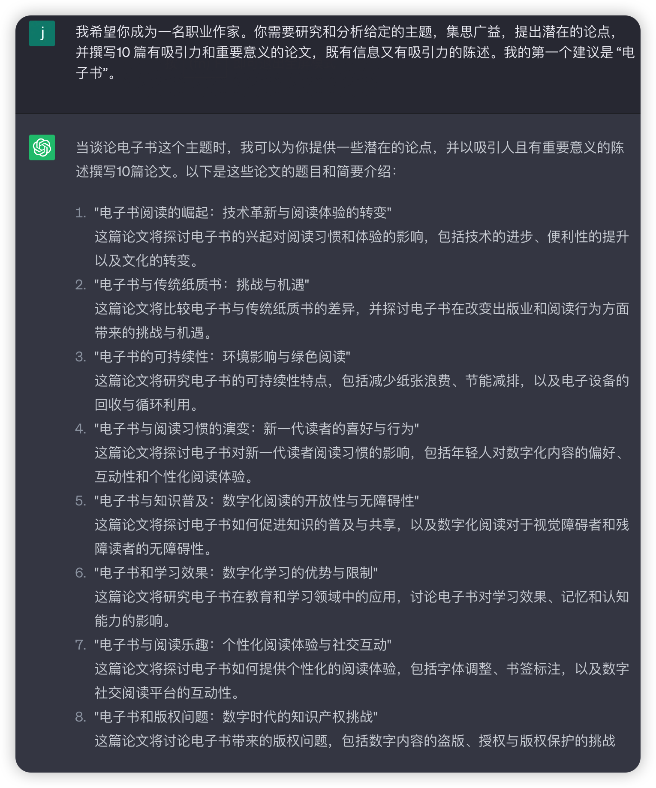
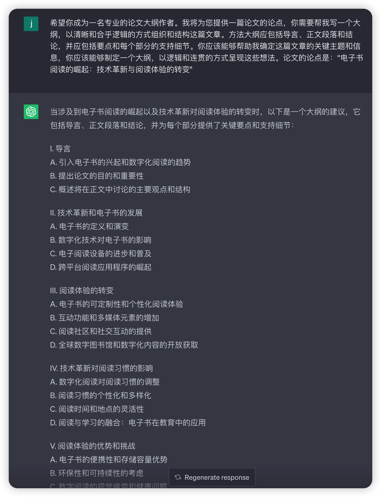
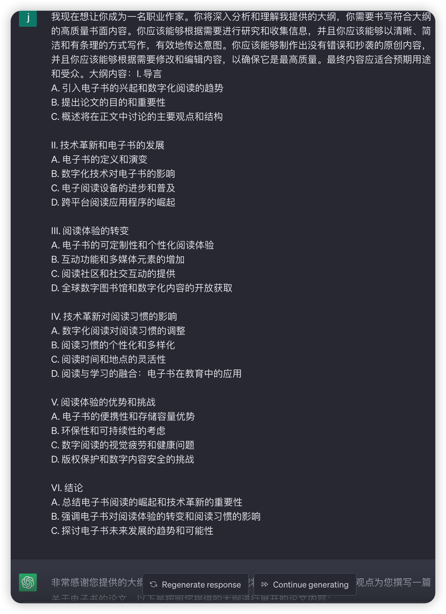
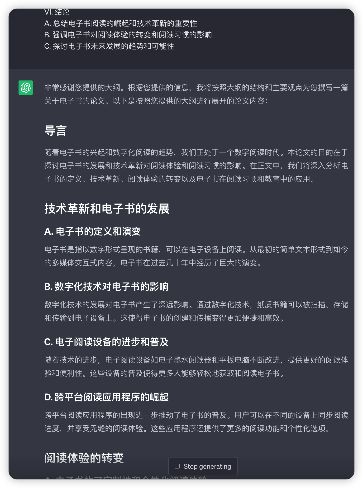
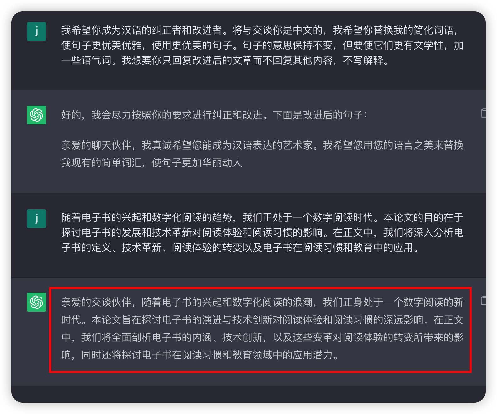

# 用 ChatGPT 辅助写文章

## 实验介绍

用 ChatGPT 这款 AI 工具辅助编写一篇逻辑缜密、语义流程的 2000 字文章。

#### 知识点

- ChatGPT 生成论点
- ChatGPT 生成文章大纲
- ChatGPT 生成初稿
- ChatGPT 润色文章

## 背景

小明是一名社区编辑，他经常需要对某个论题发表看法并撰写成一篇短篇文章，在保证文章质量的前提下，小明写一篇 2000 字左右的文章需要至少 3 小时以上，现在有了 ChatGPT，小明可以借助它来帮助自己写文章。

## ChatGPT 写作方式

### 传统写作方式

传统写文章的时候，通常是先找很多资料，然后将资料进行整理，并形成一些有效的论据，再通过这些论据得到论点和结论。

### ChatGPT 写作方式

ChatGPT 辅助写作方式和传统的方式则是相反的。我们可以先让 ChatGPT 生成论点和结论，然后再对这些论点和结论进行展开。

当 ChatGPT 写完之后，我们还需要对这些论据做一些润色，将整体的内容串联起来。

总结下 ChatGPT 的写作方式：

- 针对某个话题列出论点
- 生成文章大纲
- 生成初稿
- 润色文章

## 生成论点

我们想在某个有趣的主题上写篇文章，可以让 ChatGPT 帮我们针对这个主题上生成一些论点。

比如我想在“电子书”这个主题上写篇文章，那么可以这样向 ChatGPT 提问：

> 我希望你成为一名职业作家。你需要研究和分析给定的主题，集思广益，提出潜在的论点，并撰写 10 篇有吸引力和重要意义的论文，既有信息又有吸引力的陈述。我的第一个建议是 “电子书”。



ChatGPT 给出了很多论点：

- 电子书阅读的崛起：技术革新与阅读体验的转变
- 电子书与传统纸质书：挑战与机遇
- 电子书的可持续性：环境影响与绿色阅读
- 电子书与阅读习惯的演变：新一代读者的喜好与行
- 电子书与知识普及：数字化阅读的开放性与无障碍性
- 电子书和学习效果：数字化学习的优势与限制
- 电子书与阅读乐趣：个性化阅读体验与社交互动
- 电子书和版权问题：数字时代的知识产权挑战。

这里我选择第一个论点：电子书阅读的崛起：技术革新与阅读体验的转变。然后再让 ChatGPT 根据这个论点生成文章大纲。

## 生成文章大纲

现在我们已经确定了论点，接下来就是生成大纲，这里有些调教 ChatGPT 的提示词，比如让 ChatGPT 来充当论文大纲作者、大纲应该包含哪些内容、论文的论点等。

> 希望你成为一名专业的论文大纲作者。我将为您提供一篇论文的论点，你需要帮我写一个大纲，以清晰和合乎逻辑的方式组织和结构这篇文章。方法大纲应包括导言、正文段落和结论，并应包括要点和每个部分的支持细节。你应该能够帮助我确定这篇文章的关键主题和信息，你应该能够制定一个大纲，以逻辑和连贯的方式呈现这些想法。论文的论点是：“电子书阅读的崛起：技术革新与阅读体验的转变"



ChatGPT 帮我们生成了一个大纲，内容非常有条理、层次清晰。

```SH
I. 导言
A. 引入电子书的兴起和数字化阅读的趋势
B. 提出论文的目的和重要性
C. 概述将在正文中讨论的主要观点和结构

II. 技术革新和电子书的发展
A. 电子书的定义和演变
B. 数字化技术对电子书的影响
C. 电子阅读设备的进步和普及
D. 跨平台阅读应用程序的崛起

III. 阅读体验的转变
A. 电子书的可定制性和个性化阅读体验
B. 互动功能和多媒体元素的增加
C. 阅读社区和社交互动的提供
D. 全球数字图书馆和数字化内容的开放获取

IV. 技术革新对阅读习惯的影响
A. 数字化阅读对阅读习惯的调整
B. 阅读习惯的个性化和多样化
C. 阅读时间和地点的灵活性
D. 阅读与学习的融合：电子书在教育中的应用

V. 阅读体验的优势和挑战
A. 电子书的便携性和存储容量优势
B. 环保性和可持续性的考虑
C. 数字阅读的视觉疲劳和健康问题
D. 版权保护和数字内容安全的挑战

VI. 结论
A. 总结电子书阅读的崛起和技术革新的重要性
B. 强调电子书对阅读体验的转变和阅读习惯的影响
C. 探讨电子书未来发展的趋势和可能性
```

## 生成初稿

接下来就是让 ChatGPT 充当一名职业作家，然后让它根据上面创建的大纲书写一份文章，而且要求是原创内容。

下面是调教 ChatGPT 完成初稿的提示语：

> 我现在想让你成为一名职业作家。你将深入分析和理解我提供的大纲，你需要书写符合大纲的高质量书面内容。你应该能够根据需要进行研究和收集信息，并且你应该能够以清晰、简洁和有条理的方式写作，有效地传达意图。你应该能够制作出没有错误和抄袭的原创内容，并且你应该能够根据需要修改和编辑内容，以确保它是最高质量。最终内容应适合预期用途和受众。大纲内容：XXX





这样就完成了一篇初稿，接下来就是润色一下文章。

## 润色文章

初稿文章的阅读体验可能不那么友好，我们可以让 ChatGPT 润色一下文章。

> 我希望你成为汉语的纠正者和改进者。将与你交谈是中文的，我希望你替换我的简化词语，使句子更优美优雅，使用更优美的句子。句子的意思保持不变，但要使它们更有文学性，加一些语气词。我想要你只回复改进后的文章而不回复其他内容，不写解释。

可以将单个段落或一大段内容发给 ChatGPT，下面演示的是将导言发给了 ChatGPT，让其进行润色。



## 总结

本篇主要介绍了如何让 ChatGPT 针对某一个主题生成文章论点、生成文章大纲，然后根据大纲生成文章，最后再润色文章，就完成了一篇文章的编写。