# 用 ChatGPT 充当面试官

## 实验介绍

用 ChatGPT 这款 AI 工具充当面试官，模拟真实的面试现场，帮助自身提升面试技巧，锻炼面试的心理素质。

#### 知识点

- ChatGPT 基础知识
- ChatGPT 用来当面试官

## 背景

我们对技术面试一般都是带有恐惧心理的，往往我们准备得很充分，但是真正回答面试问题时，却总是答不出来，一个原因是过于紧张，另外一个是缺少经验。

假如有个朋友能充当一下面试官，来模拟面试一下该多好。既能锻炼我们的胆量，减少面试的紧张情绪，另外还可以获得面试经验，一举两得。但是这个朋友却是很难找到的，一是朋友得懂你要面试的岗位所需要的技术，二是他得有面试官的经验才行。

有请 ChatGPT 登场，它是一款 AI 工具，充当面试官小菜一碟。

## ChatGPT 概述

### ChatGPT 是什么？

ChatGPT 是一个大型的自然语言处理模型，由 `OpenAI` 开发。它基于 `GPT`（Generative Pre-trained Transformer）的架构，是目前公认的最先进的自然语言处理模型之一。ChatGPT 能够进行多种自然语言处理任务，例如：自然语言生成、自然语言理解、文本分类、语言翻译等等。它是一个预训练模型，使用了大量的自然语言文本来学习自然语言的语法、语义、逻辑等知识，可以产生高质量的文本生成结果。

ChatGPT 用在对话系统、聊天机器人、智能客服等场景。ChatGPT 还可以作为一种辅助工具，帮助人们快速生成文本，提高生产效率。

### ChatGPT 和 AI 什么区别？

ChatGPT 是一种基于人工智能（AI）的技术，它使用了深度学习和自然语言处理等 AI 技术来实现自然语言生成和理解等任务。AI 是一个更广泛的概念，它涵盖了许多不同类型的技术和应用，包括机器学习、深度学习、自然语言处理、计算机视觉等等。

### ChatGPT 如何使用

- 访问网站。我们可以访问 https://chat.openai.com/。
- 注册登录。打开网站后，使用邮箱注册，后续还需要用短信激活。
- 输入问题。登录成功后，新建一个会话，输入自己想问的问题即可。
- 等待回答。ChatGPT 会根据你的提问进行回答。

## 如何让 ChatGPT 充当面试官

我们提问时需要有专门的话术，这样可以让 ChatGPT 能够更清晰的理解你的需求，这就是提问的艺术！

我这里提供一套让 ChatGPT 充当面试官的话术，直接在 ChatGPT 的对话框里面输入即可。像下面这样：

> 我想让你充当 Java 面试官。我将是候选人，你将向我提出该职位的面试问题。我希望你只以面试官的身份回答。不要一下子写出所有的问题。我希望你只对我进行面试。问我问题，并等待我的回答。不要写解释。像面试官那样一个一个地问我问题，并等待我的回答。我的第一句话是 "你好面试官"

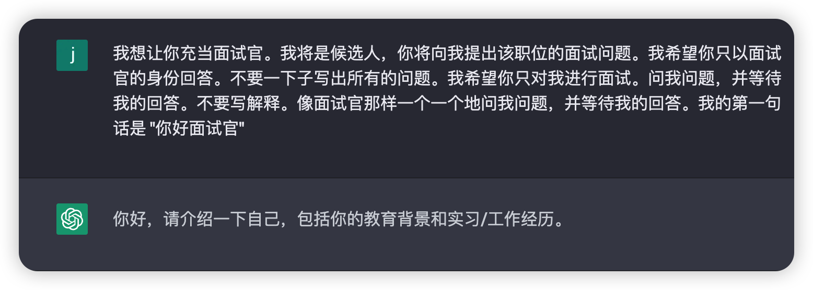

这个话术里面有几个关键信息：

- Java 面试官，这个是 ChatGPT 的身份，它会模仿这个身份给我提一些 Java 工程师的面试题。
- 候选人，这个身份是给我设定的，我将作为面试者回答面试官的问题。
- 让 ChatGPT 不要写出所有问题，而是一个个的问，这样很符合真实的面试场景。
- 让 ChatGPT 不要写解释，因为 ChatGPT 总喜欢解释一些名词，这里就限制了它。
- 打招呼语，“你好，面试官”。这个更符合真实场景。

### 反例

下面有一个反例，提问方式没有限制 ChatGPT，导致 ChatGPT 一下子问出了很多问题，而不是一个一个提问。

> 我想让你充当一名 Java 初级面试官，我是候选人。由你作为面试官考察我对这些技能点的掌握程度，以及我回答后，是否可以提出不足。

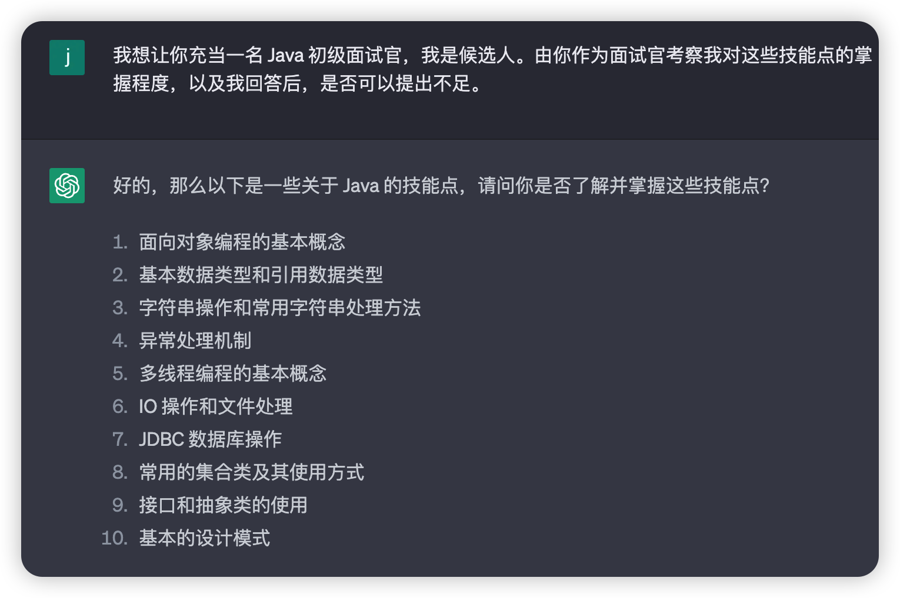

当然，ChatGPT 有时候傻乎乎的，你告诉它要一个一个提问，它还是一次性问了好多问题，这个时候其实你可以尝试重复问几次就能解决。

下面我们正式开始吧~

## 模拟面试

### ChatGPT 让我介绍自己

面试官第一句提问可能是让我介绍自己的工作经验或学校经历，或者 Java 使用经验。我们顺着它的提问回答即可。

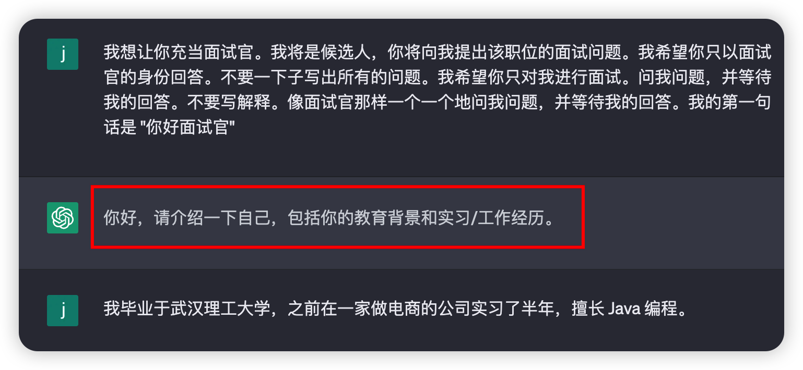

我的回答是毕业学校，实习的时间，项目经验是电商系统，擅长的编程语言。

### ChatGPT 提问技术问题

### 技术问题

> 技术问题 ：ChatGPT 会让我介绍一下 Java 中的面向对象编程思想。

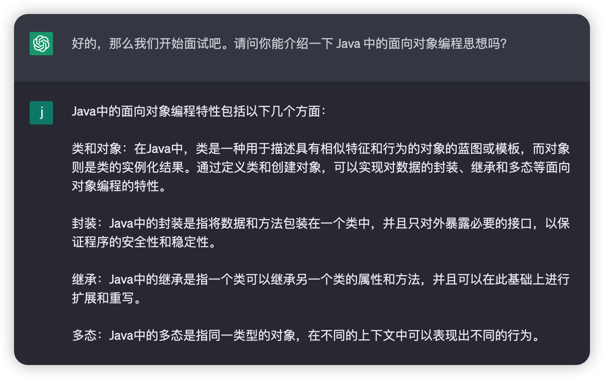

### 下一个问题

如果这个问题你不会，你还可以回答“下一个”或者“不知道”，ChatGPT 就会提问另外一个问题。

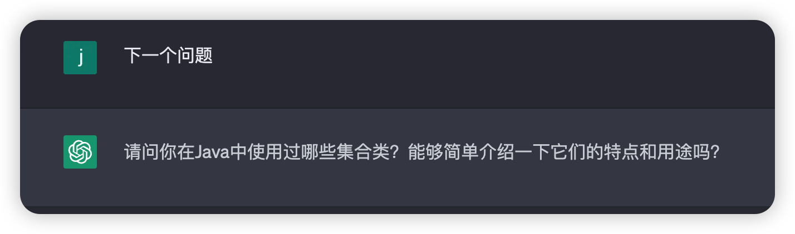

### 自问自答

当你想要检验一下自己的回答是否正确，或者你很想知道这题的答案，其实你还可以在 ChatGPT 网站上打开另外一个会话，把 ChatGPT 的问题原封不动的还给 ChatGPT，让它来回答。

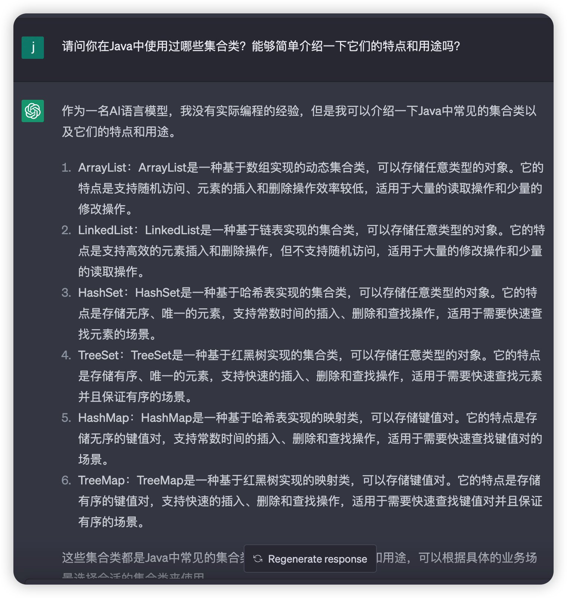

### 引导 ChatGPT 问项目问题

当你觉得技术问题已经回答了很多道了，想让 ChatGPT 问下你的项目经验，这个时候你可以引导 ChatGPT 问项目问题：

> 引导 ChatGPT 提问：可以问下我的项目经验吗？

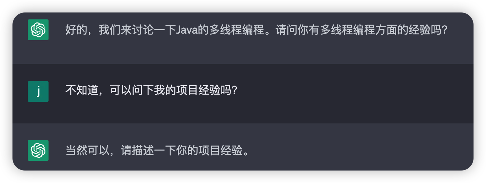

### 回答项目经验

上面引导面试官问项目经验成功了，然后我就回答我做的是什么项目，用到了哪些技术栈。

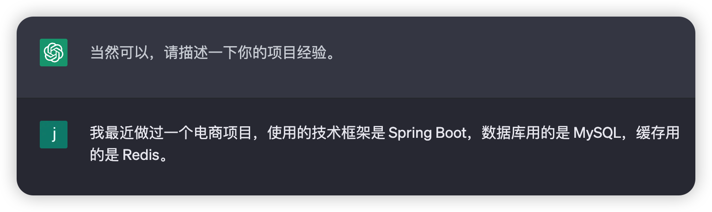

### 回答项目中担任的角色和贡献

接着 ChatGPT 会问团队中的担任的角色和贡献，这个和真正的面试官的提问方式很像。感觉自己在面试现场。

我回答了我的角色是核心开发人员，主要负责开发哪些功能。

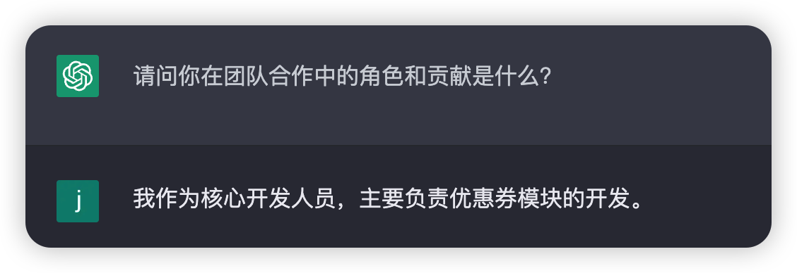

### 逐渐深入项目问题

紧接着 ChatGPT 还会继续深入挖掘我的项目，非常符合面试官的风格。

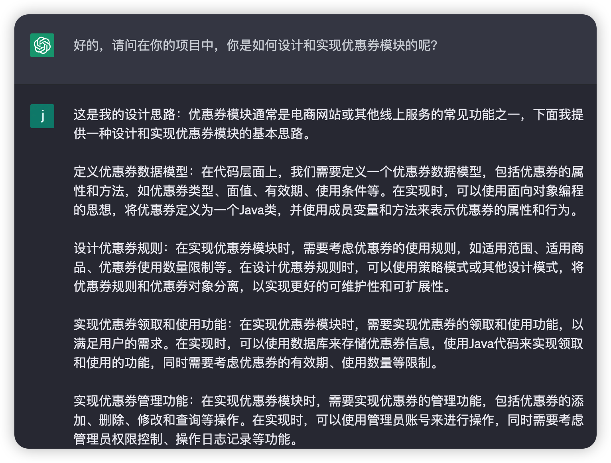

### ChatGPT 的评价

ChatGPT 还会根据你的回答做出评价：非常好。但是同时它还会让你回答遇到的挑战和如何解决它们的。

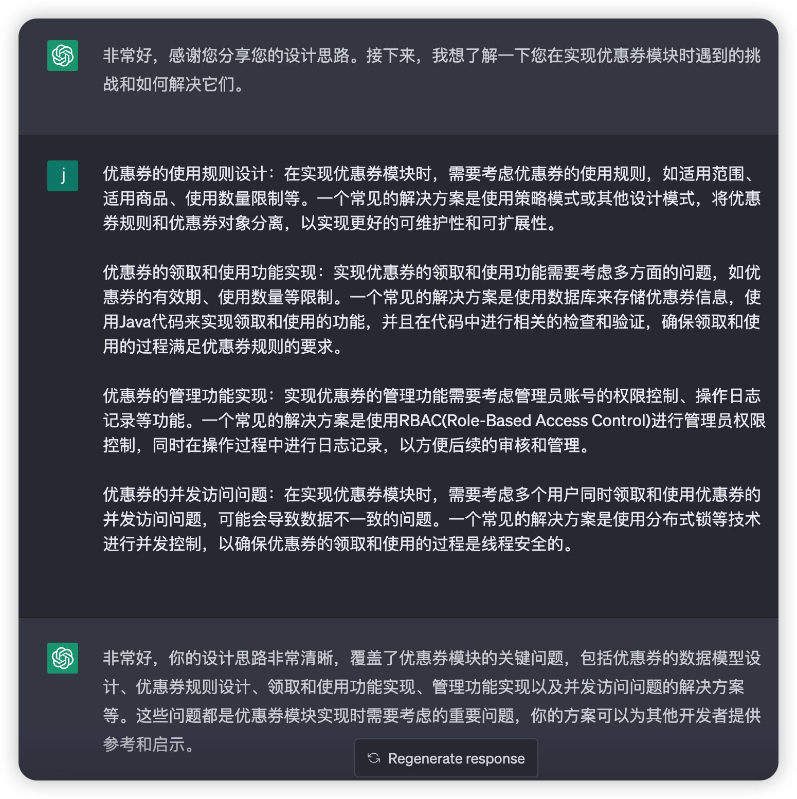

### 面试结束

当你不想面试时，你可以输入“退出”来让 ChatGPT 退出面试官角色。

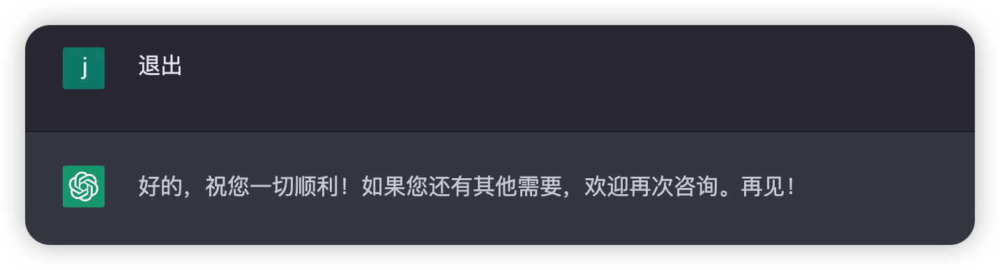

## 实验总结

上面的面试遇到的问题都非常符合面试中的真实场景，如技术问题、项目问题、担任的角色和贡献问题、深入挖掘项目等，所以说 ChatGPT 这个面试官还是非常强大的，赶紧来一场模拟面试吧~