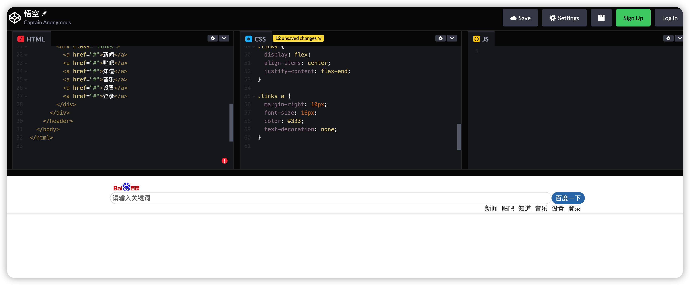

# 用 ChatGPT 充当网页开发者

## 实验介绍

用 ChatGPT 这款 AI 工具充当网页开发者，实现一个类似百度网站的首页，帮助学习网页开发。

#### 知识点

- ChatGPT 用来辅助开发网页
- ChatGPT 理解上下文

## 背景

在大学期间，我们学过 Web 网站的开发，当时涉及的知识点是很多的，比如 HTML 的各个标签的含义，CSS 的样式定义等等。

而如果要开发一个 Web 网站，比如百度首页，需要学习很多的基础知识才能做出来，现如今有了 ChatGPT，只需要告诉 ChatGPT，它就会帮我们快速开发一个百度首页的网站，让我们能更加直观地看到 Web 网站是如何开发出来的。

而且我们可以在 ChatGPT 提供的示例代码上进行修改，完成自己想要的功能。

相比自己闷头看书学习，ChatGPT 这款 AI 工具确实帮了我们大忙。

## 如何让 ChatGPT 充当网页开发者

我们开门见山来告诉 ChatGPT 开发一个百度网站。

> 我想让你担任网页开发者，我来提供需求，你来编写代码。我的第一个需求是编写一个百度的网站。

ChatGPT 没有按照我们的要求帮我写出网页的代码，而是回答了一些编写百度网站的注意事项，比如网站功能、技术架构、用户体验、安全性，虽然这些注意事项很重要，但并不是我们想要的，我们主要是想学习如何编写网站的代码。

### 调整话术——指定编程语言

我们调整下话术，让 ChatGPT 知道我们要用哪种编程语言。开发网页肯定得用 `HTML` 和 `CSS`，话术里面需要包含这个关键信息。

> 编写一个百度首页的网站，包含 HTML 和 CSS 代码

ChatGPT 回答了一个基本的百度首页的 HTML 和 CSS 代码。

下面是 HTML 代码:

CSS 代码如下：

我们可以直接点击示例代码的右上方的 `Copy code` 按钮将 HTML 代码和 CSS 代码复制出来。

### 在线展示 Web 页面

这里我提供一个在线预览 HTML 代码和 CSS 代码的网站：

> https://codepen.io/pen/

我们把 HTML 和 CSS 代码拷贝到这个网站上对应的输入框中，就可以实时预览网站内容了。

如下图所示，百度首页的网站就出来了。

这段代码将显示一个类似于百度首页的网页，其中包含一个搜索栏、百度 logo 和一些常用链接。当用户在搜索栏中输入关键词并点击“百度一下”按钮时，网页将提交表单并显示相应的搜索结果。

当我们输入关键词进行搜索时，会跳转到 `404` 页面。如下图所示：

这不符合我们的预期，我们想让搜索也能正常跳转到百度页面。

### 加上搜索功能

我们来加上一些话术，让 ChatGPT 实现一个搜索的功能。

> 编写一个百度首页的网站，并具有基本的搜索功能，包含 HTML 和 CSS 代码。

下面是 ChatGPT 的回答，我们把回答中的 HTML 代码和 CSS 代码拷贝到在线生成网页的网站上。

在网页的输入框中输入`悟空`，然后点击`百度一下`，就跳转到了真正的百度页面了。如下图所示：

这样一个基本的百度首页就完成了。

## 代码很长怎么办？

有时候 ChatGPT 回答的代码太长了会被截断，如下图所示，CSS 代码被截断了。

那如何让 ChatGPT 输出完整代码呢？

> 关键语句：继续上面的 CSS 代码。

ChatGPT 就会给出一个完整的 CSS 代码了，可能和上面的 CSS 代码有些区别。

## 如何学习上面的代码？

ChatGPT 已经帮我们写好了网页代码，如果我们想学习这些代码怎么办？

我们来问下 ChatGPT 这段代码的含义就好了。

> 关键语句：解释一下上面的 JS 代码

ChatGPT 会根据它自己写的代码进行解释，也就是说 ChatGPT 具有理解上下文的能力。通过 ChatGPT 边写代码边给我们解释，这样我们学起来就轻松很多了。

## 实验总结

通过让 ChatGPT 充当一位网页开发者，并让其对代码进行解释，我们可以立即看到代码呈现的效果，还能从中学到网页开发的知识，这种方式的学习对于初学者是非常友好的，也能帮助初学者快速吸收知识。

在使用 ChatGPT 的过程中，需要注意 ChatGPT 的回答是有字数限制的，特别是回答代码时，我们需要利用一些技巧让 ChatGPT 输出完整的信息。

另外 ChatGPT 还能理解上下文的语境，比如我们想知道 ChatGPT 上面写的代码是什么意思，ChatGPT 就会联系上下文来回答。

所以说 ChatGPT 这个网页开发者还是非常强大的，赶紧来开发一个网页吧~