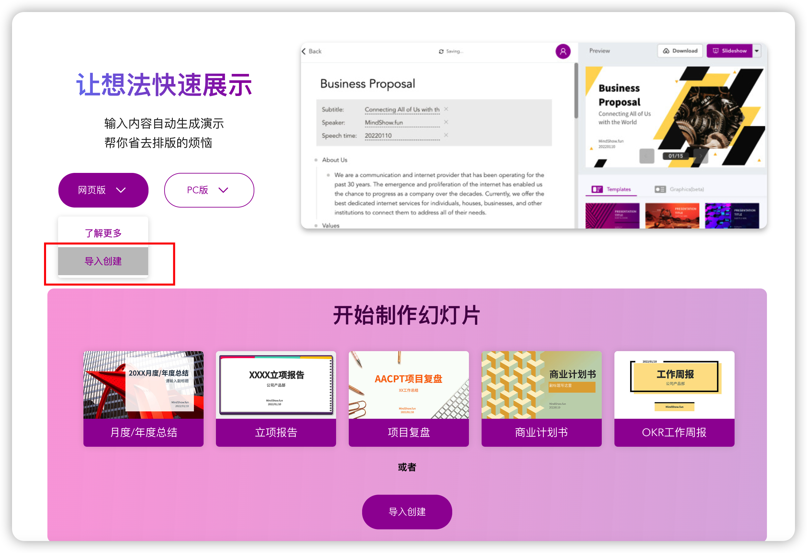

# 用 ChatGPT 写 PPT

## 实验介绍

用 ChatGPT 这款 AI 工具来帮助自己写 PPT 大纲，然后将 PPT 大纲转换成 `Markdown` 格式的内容，最后通过在线网站将 Markdown 内容转换成好看的 PPT。

#### 知识点

- ChatGPT 用来辅助写 PPT 内容
- Markdown 文本生成 PPT

## 背景

在上大学期间，都必须通过答辩才能毕业，而答辩是需要通过 PPT 来讲述自己的毕业设计的，当时做 PPT 是一个比较痛苦的过程。

从学校毕业后，进入到了职场，没想到还要写 PPT，比如转正答辩 PPT，技术方案 PPT 等等。

如果想让自己的职业发展顺利点，写好 PPT 也是一门技术活，也没有人教你怎么写好 PPT，只能自己学。

现在有了 ChatGPT 这款 AI 工具，它可以帮助我们如何写 PPT，另外加上一款文字转 PPT 的工具，瞬间就能生成既好看又实用的 PPT。

## 如何让 ChatGPT 写 PPT

### ChatGPT 能直接生成 PPT 文件吗？

首先我们知道，ChatGPT 是一款文本生成工具，并不能直接帮我们制作一个 PPT 文件，ChatGPT 也不具备生成好看的 PPT 样式，我们利用的是 ChatGPT 生成我们想要的文字内容。

也就是说我们可以先让 ChatGPT 生成多张 PPT 的文字内容，然后我们再利用 PPT 生成工具将文字内容转换成好看的 PPT。

### 让 ChatGPT 围绕一个主题生成 PPT 大纲

想让 ChatGPT 帮我们生成 PPT 文字内容，就得告诉 ChatGPT 这个 PPT 的主题是什么？

比如我想让 ChatGPT 生成一个关于网络安全的 PPT 就可以这样向 ChatGPT 提问

> 帮我写一个 网络安全的 ppt

ChatGPT 就会帮忙写一个关于网络安全的 PPT 大纲。如下所示：

ChatGPT 的回答里面还有 Slide1 和 Silde2 等等，这个代表 PPT 不同的页。它总共给我列了 10 张 PPT 的内容。

然后我们可以打开微软的 PowerPoint 工具或者 WPS 工具，将上述内容按照它的分页来一页一页的手动制作。

不过这种手动复制一页一页制作的方式是不是太麻烦了，而且还涉及到后续的排版工作，着实有点麻烦。

有没有更简便的方式呢？

当然有的，我们利用一款在线生成 PPT 的网站即可办到，不过我们首先得将上述内容转换成 Markdown 格式的内容。

### Markdown 是什么？

我们需要简单了解下 Markdown 是什么。

Markdown 是一种用符号快速排版的语言，类似于我们在微信或者 QQ 中用的表情符号，但是比表情符号要复杂一些。它可以让我们快速、简单地写出格式化的文本，比如加粗、斜体、标题等等。这个语言特别适合写博客、写技术文档、写程序代码等等，因为它可以把复杂的排版变得非常简单易懂。

使用 Markdown 语言的方式非常简单，就是用一些简单的符号来表示一些排版格式，比如使用 * 符号表示加粗，使用 # 符号表示标题等等。这样，你就可以快速、简单地让你的文章看起来更漂亮了。使用 Markdown 语言的好处是它非常易学易用，而且适用于很多写作场景，比如写博客、写文档、写邮件等等。

### PPT 文字内容转成 Markdown

我们可以通过 ChatGPT 将文本转换成 Markdown 格式的，直接告诉 ChatGPT 就可以办到了。

> 转成 markdown

ChatGPT 就会将上述内容转换成 markdown 格式的内容了。如下图所示，标题和副标题会有不同的文字大小。

接着我们将需要将这些内容拷贝到一个在线网站进行制作。拷贝的按钮在 ChatGPT 回答的右上角。

### 在线制作 PPT

#### 在线制作 PPT 的网站

在线制作 PPT 的网站是 `https://mindshow.fun/`，网站首页如下图所示：

#### 导入创建

点击网站上的 `导入创建`的按钮，将对应的 Markdown 内容拷贝到这个网站。

注意事项：

- 删除掉与主题无关的内容，如上面的第一句话。
- 大标题（#网络安全：保护您的数据和隐私）不需要粘贴进来，大标题会在下一步填写。

#### 调整内容

我们可以实时调整 PPT 的文字内容，另外还可以在 markdown 内容里面加上一些图片。如下图所示：

#### 填写大标题、副标题

填写好大标题、副标题、演讲者、演讲时间就可以实时生成 PPT 了。

#### 选择模版

如果你不喜欢网站提供的默认版本，我们可以选择自己心仪的模版。需要注意的是有些模版是收费的。免费的模版其实已经够用了，比如下面这个模版就是免费使用的。

#### 调整布局

默认生成的文字样式其实很单调的，如下图所示：

如果想让 PPT 更好看一点的话，还可以选择不同的布局方式。

如下图所示，这样是不是好看多了？

#### 在线预览

我们制作好 PPT 后，还可以使用在线预览的功能来看下整体的效果。

#### 下载 PPT

预览没问题后，就可以下载下来了。有两种格式可供选择，PDF 格式和 PPTX 格式，如果你还需要在本地通过 PPT 工具再次编辑处理，就选择 PPTX 格式，如果只是查看，则两种格式都可以。需要注意的是，PPTX 格式下载的文件中不包含添加的图片。

## 实验总结

通过让 ChatGPT 充当一位 PPT 制作者，它的能力体现在快速围绕一个主题制作出一个 PPT 大纲。并让它转换成 Markdown 格式的内容。

然后我们将上述内容导入到在线制作 PPT 的网站，并对内容进行二次加工、选择模版、调整布局等操作后，就制作出了一个非常好看又实用的 PPT 了。

这么好用的功能，快来试下吧~