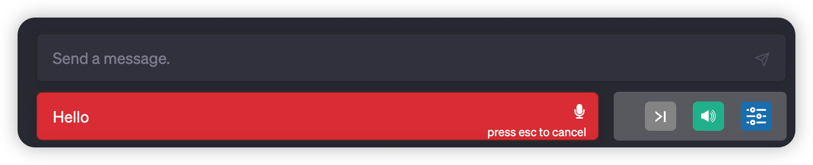

# 用 ChatGPT 练习英语口语和听力

## 实验介绍

用 ChatGPT 这款 AI 工具配合语音插件来帮助练习英语口语发音和听力。

#### 知识点

- ChatGPT 语音插件的使用

## 背景

记得在大学期间，我们每周都会上两节英语课，而上课的形式是在电脑上朗读屏幕上的英文，电脑会录制我们朗读的内容，然后对这些内容进行评分，但是这个评分是很粗的概念，并不能告诉我们哪个单词说得有问题。

而练习听力的方式是听电脑上的一段录音，然后需要根据这段录音做一个选择题，这种方式是非常枯燥的。

如果想快速提升英语口语和听力，应该是通过在一个场景里面进行对话的方式来练习。

现在有了 ChatGPT 这款 AI 工具，它可以借助 Chrome 的语音插件来帮助我们练习英语口语和听力。

我们不仅可以设定不同的对话场景，还能实时得到我们发音的反馈，假如我们听不懂，还能回看 ChatGPT 回答的英文内容，这种效果远比我们做练习题更有效。

## 如何让 ChatGPT 具备语音功能

我们知道 ChatGPT 只具备生成文本的能力，是不具备语音识别和发音的能力的。为了让 ChatGPT 具备语音能力，我们可以通过 `Google Chrome` 浏览器的应用商店，给浏览器安装一个 ChatGPT 专属的语音插件。

### 安装语音插件

我们以 Chrome 浏览器作为演示，通过打开下方的链接找到语音插件。

```sh
https://chrome.google.com/webstore/search/chatgpt%20voice%20control?hl=zh-CN&_category=extensions
```


选择第二个插件：`Voice Control for ChatGPT`，点击右上角的添加到 Chrome 按钮。


添加完成后，刷新 ChatGPT 网站就可以看到语音输入按钮了。


## 练习英语口语和听力

### 如何发送语音

插件的功能如下图所示：


我们最常用的就是语音输入按钮。当我们想要对 ChatGPT 说话时，点击一下语音输入按钮即可，说完之后，这个插件会将其转换成文本，我们再次点击语音输入按钮或输入`空格`即可将文本内容发送给 ChatGPT。

比如我说了一句 `Hello`，再次输入空格即可发送了。



### 开始练习

先来个最简单的口语：

> Hello, How are you?


然后 ChatGPT 就会输出一段英文文本，这个插件会实时的朗读这段文本，这样我们就可以练习听力了。

再来个稍微复杂一点的：

> What about the book?

接着 ChatGPT 会让你提供更多的信息，我继续说是 Harry Potter（哈利波特），然后 ChatGPT 就会描述这本书的内容。而插件也会同时念出这段英文。


## 实验总结

通过让 ChatGPT 充当英语对话者，然后结合 ChatGPT 语音插件实现语音识别及文本转换语音，就可以帮助我们来练习英语口语和听力。

而且我们不仅可以练习英语，还可以练习中文，练习法语，练习德文等等。

这么好用的功能，快来试下吧~