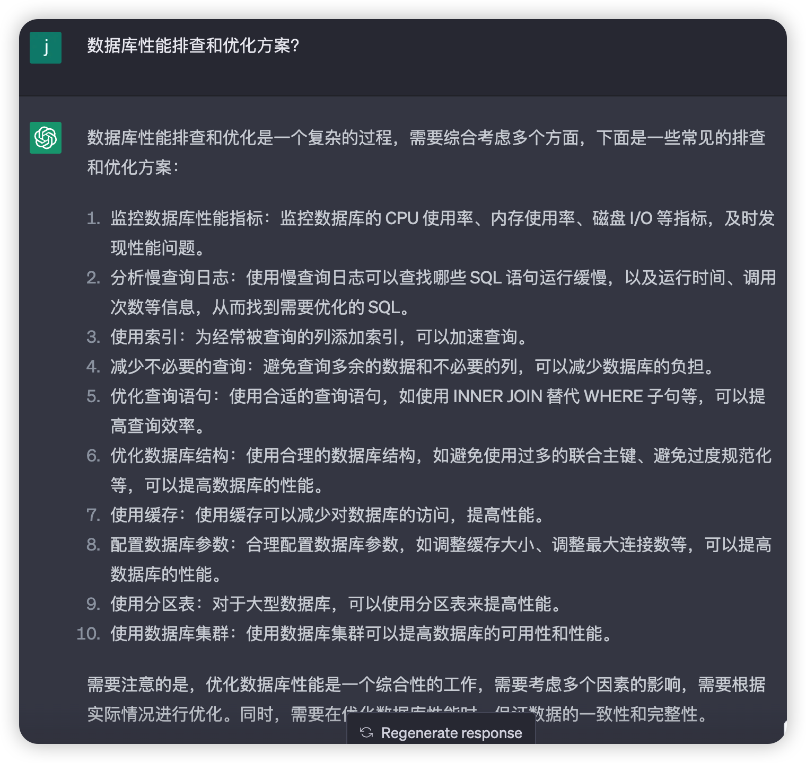

# 用 ChatGPT 优化 SQL

## 实验介绍

用 ChatGPT 这款 AI 工具帮助优化 SQL 语句的写法，提升查询的性能。

#### 知识点

- ChatGPT 优化 SQL 语句
- ChatGPT 对数据库进行性能优化

## 背景

小李参加工作后，入职了一家互联网公司，成为了一名程序员，工作中经常需要写 SQL 脚本来对数据库进行查询，而互联网公司最大的一个特点就是数据量很大，而查询很大的数据量时，经常会遇到查询很慢的问题，而如何优化查询的性能是一名优秀程序员必须掌握的。

对于刚刚毕业的小李，对优化 SQL 的查询还没有经验，遇到问题后也无从下手。

现在有了 ChatGPT 这款 AI 工具，它可以提供优化的方案，并解释为什么可以这么优化。小李既可以学到如何优化 SQL 语句，还能快速解决问题，一举两得。

下面我们就来看下如何用 ChatGPT 完成 SQL 的优化。

## 准备工作

目前我本地有一张数据表：

- 表名：`user_behavior_full`。
- 字段：`user_id`、`item_id`、`category_id`、`behavior`、`timestamp`。
- 数量：100 万条数据


数据示例：


这张表的数据可以从下面这个网站获取，然后导入到数据库即可。

下载地址：https://tianchi.aliyun.com/dataset/649

## 慢查询 SQL 语句

### 慢查询示例

我们先来看一条慢查询 SQL 语句：

```SQL
SELECT item_id FROM user_behavior_full WHERE behavior = 'pv';
```

这段 SQL 的表示从 user_behavior_full 表中查询满足条件 behavior 等于 pv 的数据，然后把这些数据的中 item_id 的最大值返回。

下面是这段 SQL 语句返回的结果，返回了 item_id 的最大值：999975。


这张表 user_behavior_full 有 100 万条数据，上述的查询是非常慢的，可以看到运行时间 1 秒，如果数据量增大到 1000 万，查询会更慢。

### 执行计划

我们还可以看下这段 SQL 的执行计划，执行了一个`全表扫描`，总共扫描了 99 万行数据


这个查询是很慢的，我们如何进行优化呢？先让 ChatGPT 给我们一个方案试试看。

## ChatGPT 优化 SQL 语句

如何让 ChatGPT 优化 SQL 语句呢？这里有一个示例：

> 优化一下这段 SQL：SELECT MAX(item_id) FROM user_behavior_full WHERE behavior = 'pv'

然后 ChatGPT 就会告诉我们如何进行优化。如下图所示：


ChatGPT 告诉了我们两种方案：

1. 添加索引：在 `user_behavior_full` 表中添加 `(behavior, item_id)` 的联合索引，可以加快查询速度。
2. 使用 LIMIT：由于我们只需要获取 `item_id` 的最大值，因此可以使用 `LIMIT` 关键字来限制结果集数量，避免全表扫描。

还贴心的给出了优化后的 SQL 语句：

```SQL
SELECT MAX(item_id) FROM user_behavior_full WHERE behavior = 'pv' LIMIT 1;
```

然后 ChatGPT 还告诉我们如何添加一个联合索引来加速查询：

```SQL
CREATE INDEX idx_user_behavior_full ON user_behavior_full(behavior, item_id);
```

另外 ChatGPT 还告诉我们索引还会带来什么问题，比如写入操作的性能会降低。

### 验证 ChatGPT 的方案

我们按照 ChatGPT 的方案试下是否能提升查询的性能。

再次执行这段 SQL 语句，

```
SELECT MAX(item_id) FROM user_behavior_full WHERE behavior = 'pv' LIMIT 1;
```

发现查询耗时为 0.000 秒，微秒级以下了，提升确实非常明显。


从结果来看，ChatGPT 的提供的答案还是非常可靠的。

## SQL 整体优化方案

在工作中，经常会遇到各种各样的 SQL 性能问题，对于新手总是无从下手，那有没有一些好的排查和优化 SQL 性能的方案呢？

ChatGPT 就派上用场了，我们来看看 ChatGPT 怎么说的。



ChatGPT 的回答已经非常全面了，如果还想要更详细的内容，可以继续提问，比如如何优化数据库结构。


## 实验总结

通过让 ChatGPT 来帮助我们优化 SQL 语句，并从中学习到索引、执行计划的知识点，进而能提升工作中的工作效率。而且 ChatGPT 还能告诉我们很多排查和优化数据库的技巧，以后遇到性能问题就不用担心啦~