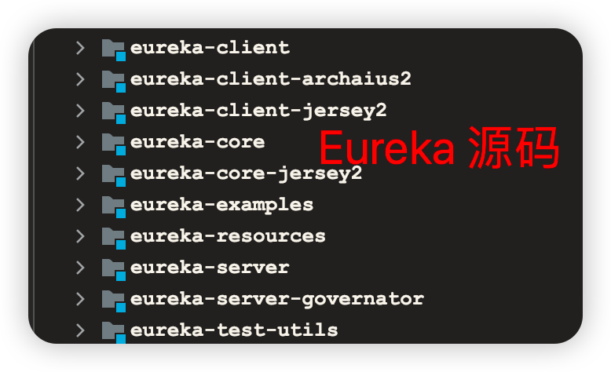
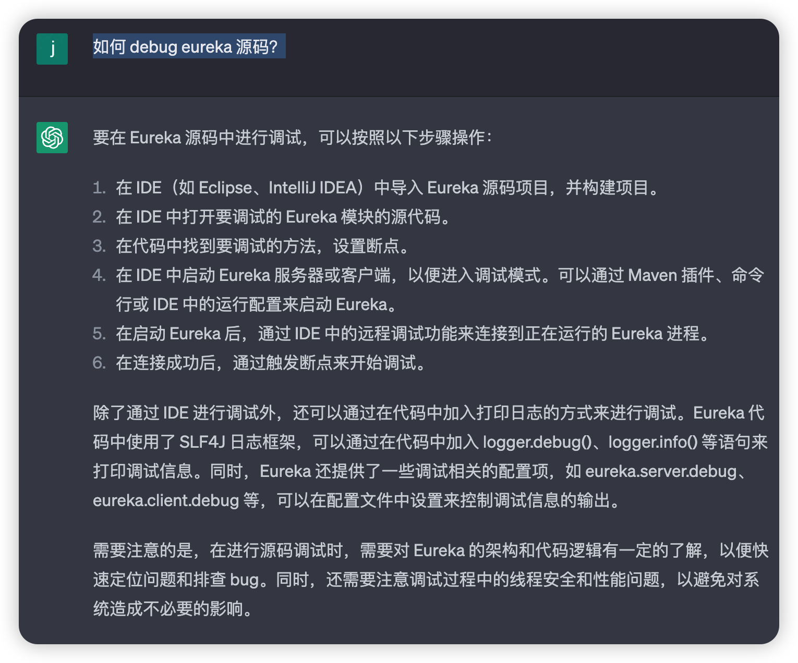
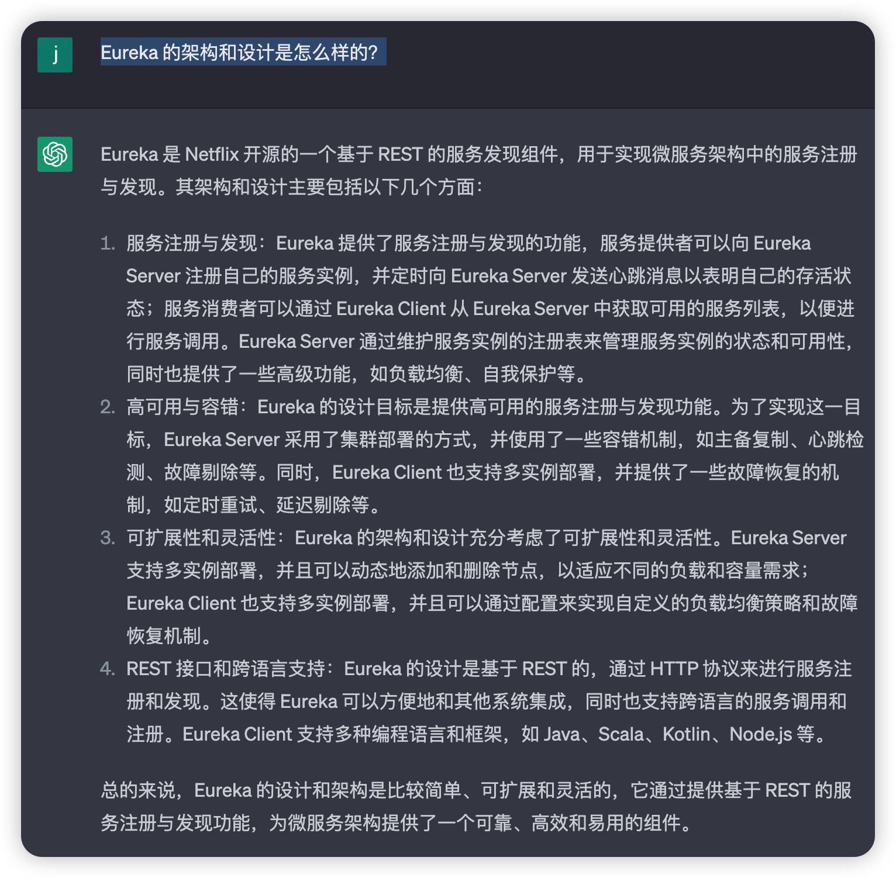
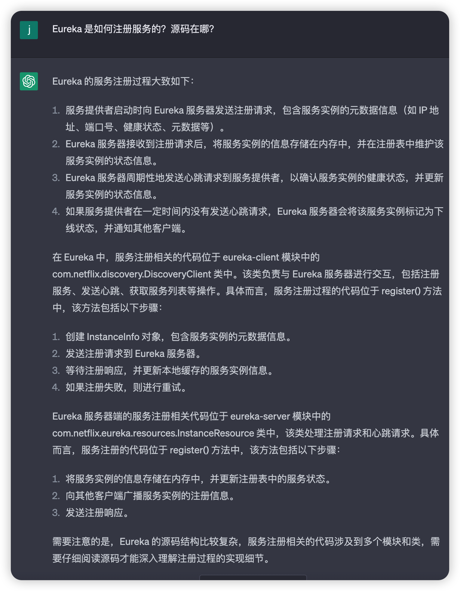
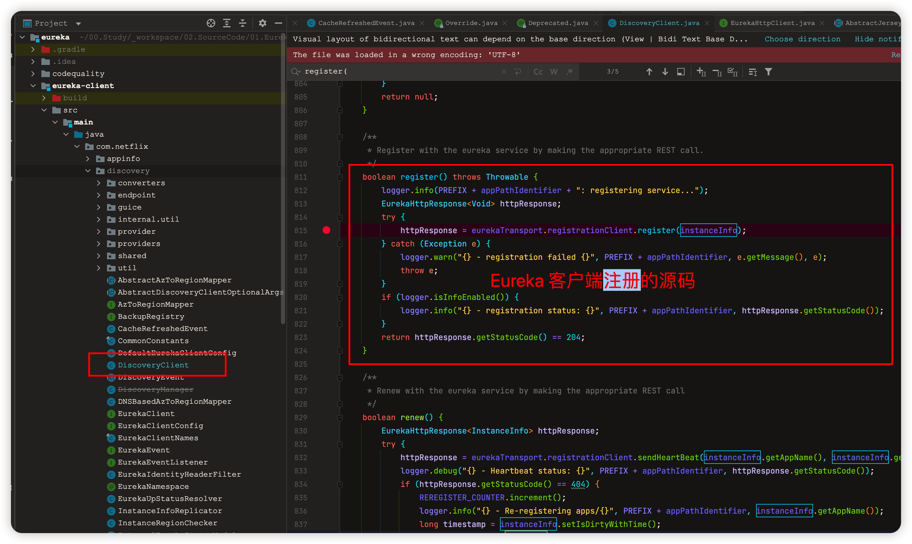
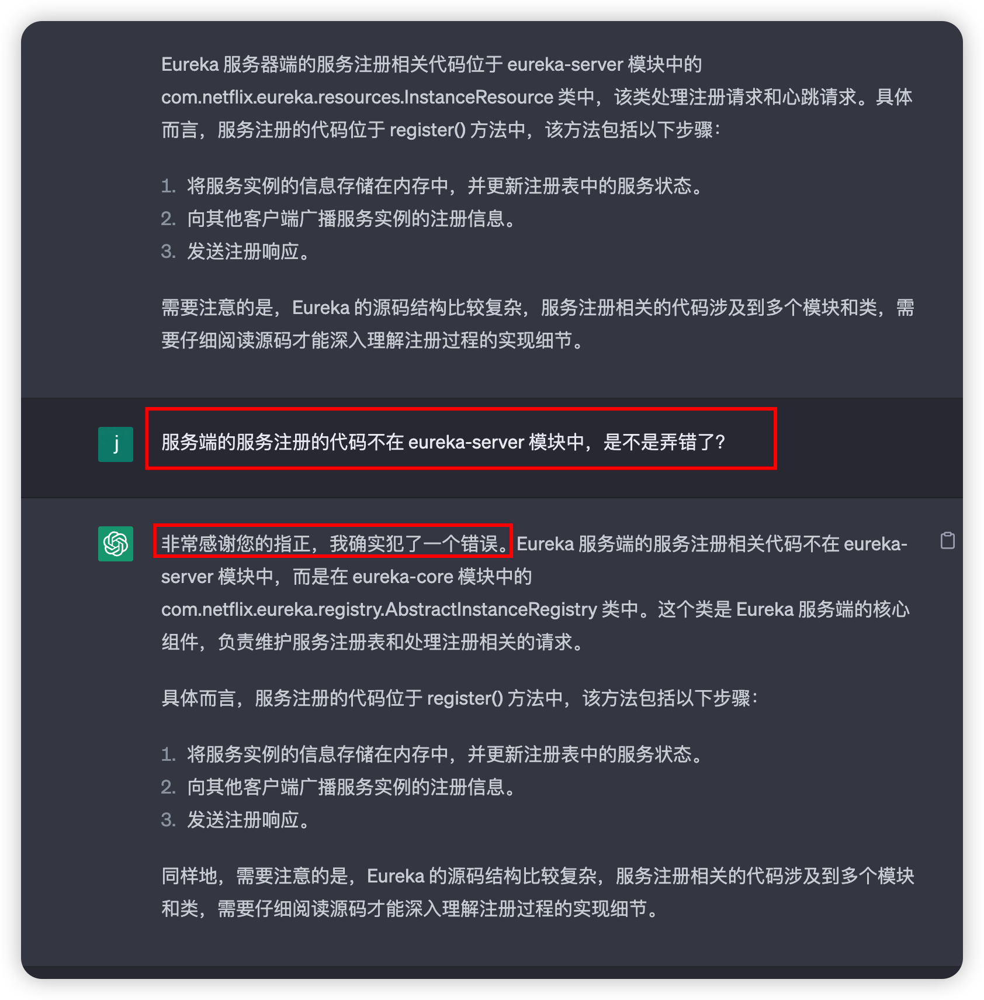
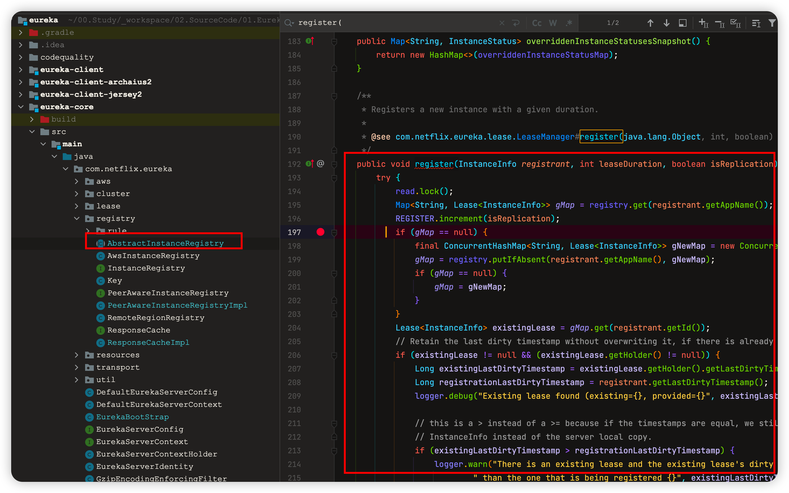

# 用 ChatGPT 学习 Eureka 中间件源码

## 实验介绍

用 ChatGPT 这款 AI 工具来辅助学习 Eureka 中间件的源码。

#### 知识点

- ChatGPT 分析中间件源码

## 背景

小李参加工作后，入职了一家互联网公司，成为了一名程序员，项目架构是微服务架构，里面用到了组件，比如注册中心就是用的 Eureka 开源中间件，网关用的是 Spring Cloud Gateway 开源中间件。这些中间件都是封装好的，而且比较复杂，但是小李经常遇到线上问题就跟这些中间件有关，所以小李需要翻看这些中间件的源码来分析问题出在哪里。

但是这些中间件的源码是非常复杂的，小李看源码遇到了这几个问题：

- 大量的代码量：中间件通常是一个大型的、复杂的项目，代码量较大，往往会有数十万行或更多的代码。因此，如果没有系统地、全面地了解整个项目的结构和代码组织方式，很难理解其中的细节和内部实现。
- 复杂的架构和设计：中间件通常涉及到多个组件、模块和插件，组件之间可能有复杂的依赖关系和交互方式。同时，中间件往往需要考虑高并发、高可用、高性能等需求，需要有相应的设计和架构来保证系统的稳定性和性能。
- 依赖的第三方库和技术栈：中间件通常需要依赖许多第三方库和技术栈，如网络库、数据库、序列化库等。这些库和技术栈往往具有一定的复杂性，如果没有熟悉这些库和技术栈，可能会难以理解中间件的具体实现。
- 缺乏文档和注释：中间件的源码可能缺乏充足的文档和注释，使得阅读代码时难以理解某些部分的实现和作用。这时，需要通过阅读代码和运行调试来深入了解。

现在有了 ChatGPT 这款 AI 工具，看它是否可以帮助我们学习中间件源码。本篇将会以 Eureka 源码作为阅读的对象。

## ChatGPT 帮助分析 Eureka 源码

### Eureka 源码在哪

阅读源码的前提是把源码下载到本地，然后用开发工具打开源码来看。我们可以向 ChatGPT 提问源码的下载地址在哪。

> Eureka 源码在哪？

ChatGPT 回答可以从 Github 上下载源码，还提供了下载地址。下载好源码后，我们可以导入到 IDEA 工具来查看源码。

另外它还告诉了我们源码的各个模块的功能，比如 eureka-core 是 Eureka 核心模块，包含服务注册、发现、心跳检测等基本功能的接口和实现。

### 调试 Eureka 源码

通常情况下，我们更倾向于调试源码，所以我们可以问下 ChatGPT 如何调试 Eureka 源码。

> 如何 debug eureka 源码？

ChatGPT 告诉我们可以通过 IDE 进行调试，还可以通过在代码中加入打印日志的方式来进行调试。

配置好 Eureka 源码的阅读环境后，我们还需要了解 Eureka 的架构和设计是怎么样的，对 Eureka 有个整体的把握。

### Eureka 架构和设计

我们可以向 ChatGPT 提问：

> Eureka 的架构和设计是怎么样的？

接下来我们可以根据自己感兴趣的一个点来逐步阅读 Eureka 源码，这里我提供几个研究方向：

- Eureka 是如何注册服务的？
- Eureka 是如何感知服务下线的？
- Eureka 注册的服务增加或下线后，是如何通知客户端的？
- Eureka 是如何实现高可用的？
- Eureka 集群模式是如何实现数据一致性的？

这里我们选择其中一个点来研究，比如**Eureka 是如何注册服务的？**

### Eureka 是如何注册服务的？

向 ChatGPT 提问：

> Eureka 是如何注册服务的？源码在哪？

Eureka 会告诉我们 Eureka 的注册过程，以及源码的位置。

对于客户端来说的，服务注册相关的代码位于 eureka-client 模块中的 com.netflix.discovery.DiscoveryClient 类中。该类负责与 Eureka 服务器进行交互，包括注册服务、发送心跳、获取服务列表等操作。服务注册过程的代码位于 register() 方法。

我们根据 ChatGPT 的回答找到源码的位置：

这个方法里面做的事情如下：

- 发送注册请求到 Eureka 服务器。
- 等待注册响应，并更新本地缓存的服务实例信息。
- 如果注册失败，则进行重试。

上面讲到的是客户端注册的逻辑，现在我们来看下服务端接收客户端注册的请求的过程。

接下来我们看下 Eureka 服务端注册的源码，ChatGPT 告诉我到 `eureka-server` 模块上寻找 `com.netflix.eureka.resources.InstanceResource` 类的 `register()` 方法，我按照它说的代码路径没找到。这个时候就要质疑 ChatGPT 有没有回答错误。

### 质疑 ChatGPT

当我们发现 ChatGPT 的回答有问题时，可以向 ChatGPT 提问是不是弄错了。

比如通过下面的方式来提问：

> 服务端的服务注册的代码不在 eureka-server 模块中，是不是弄错了？

ChatGPT 说它之前的答案确实弄错了。然后给了一个新的答案。

这次我们找到了服务端注册的代码：

这个注册方法做了以下事情：

- 将服务实例的信息存储在内存中，并更新注册表中的服务状态。
- 向其他客户端广播服务实例的注册信息。
- 发送注册响应。

按照上述步骤，我们可以继续借助 ChatGPT 来阅读源码。

### 源码阅读技巧

看源码时需要从整体脉络上有个把握，不要一开始就陷入细节，那效率是非常低的。当确实需要研究一个细节点时才去深挖那部分的代码。当看到一些不懂的代码，如果不影响整体脉络，可以先跳过，并不需要把所有的代码都看懂，后面看得越多，能够融汇贯通后，之前看不懂的地方就会豁然开朗了。

另外我们也可以一边看源码一边调试源码，里面的变量参数值，以及方法的跳转就都能看出来了。

## 实验总结

本篇主要讲解了通过 ChatGPT 来帮助分析中间件的源码，以 Eureka 中间件作为示例，涉及到如何下载 Eureka 源码、如何调试 Eureka 源码、Eureka 的架构和设计、Eureka 是如何注册服务的。

Eureka 服务的代码是非常庞大的，而且还有不同的代码版本，ChatGPT 不免会犯些错，我们通过质疑 ChatGPT 的方式，让 ChatGPT 给出了正确的答案。

最后也提到了阅读源码的技巧，不要陷入细枝末节中，需要从整体脉络上阅读源码。