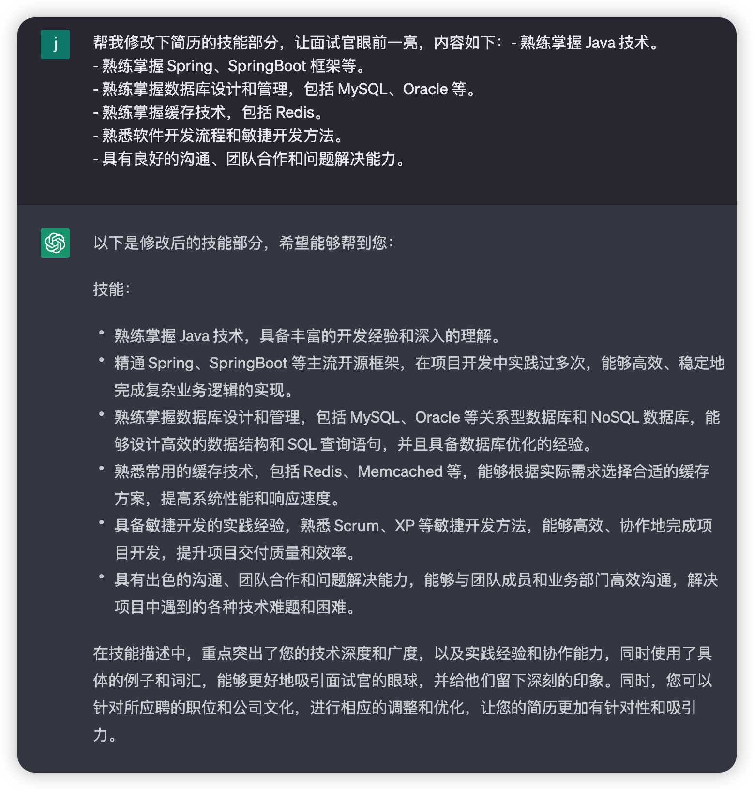
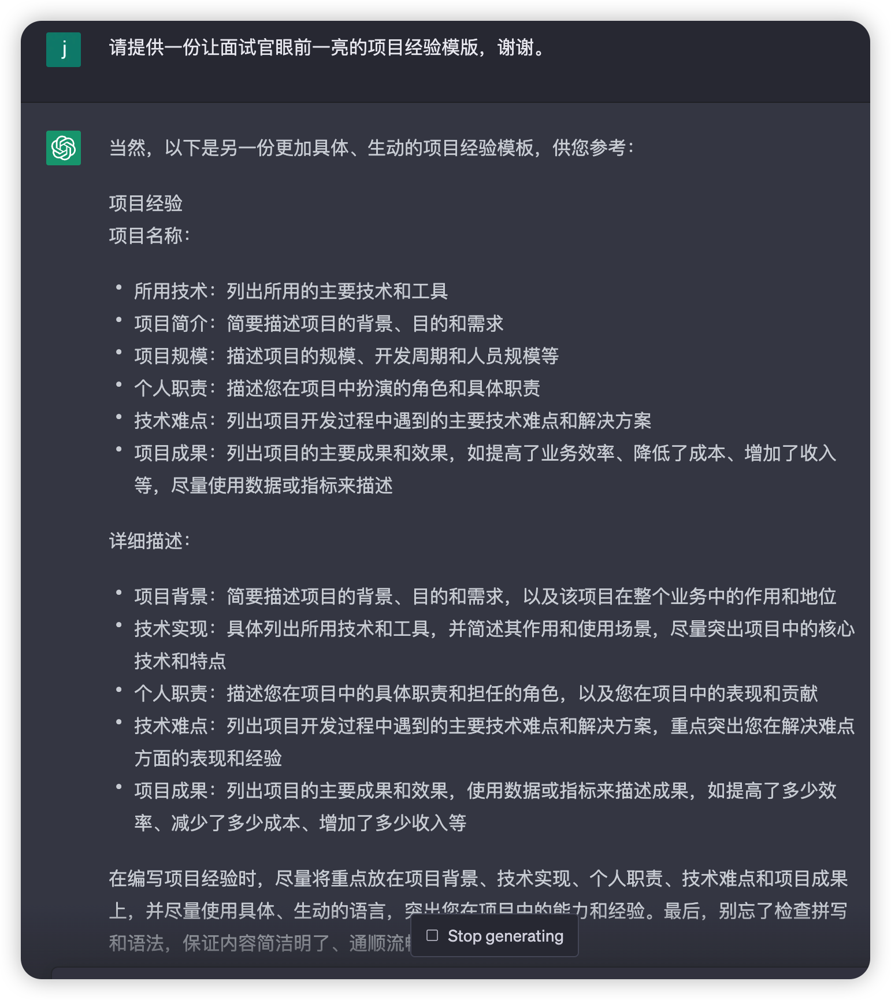
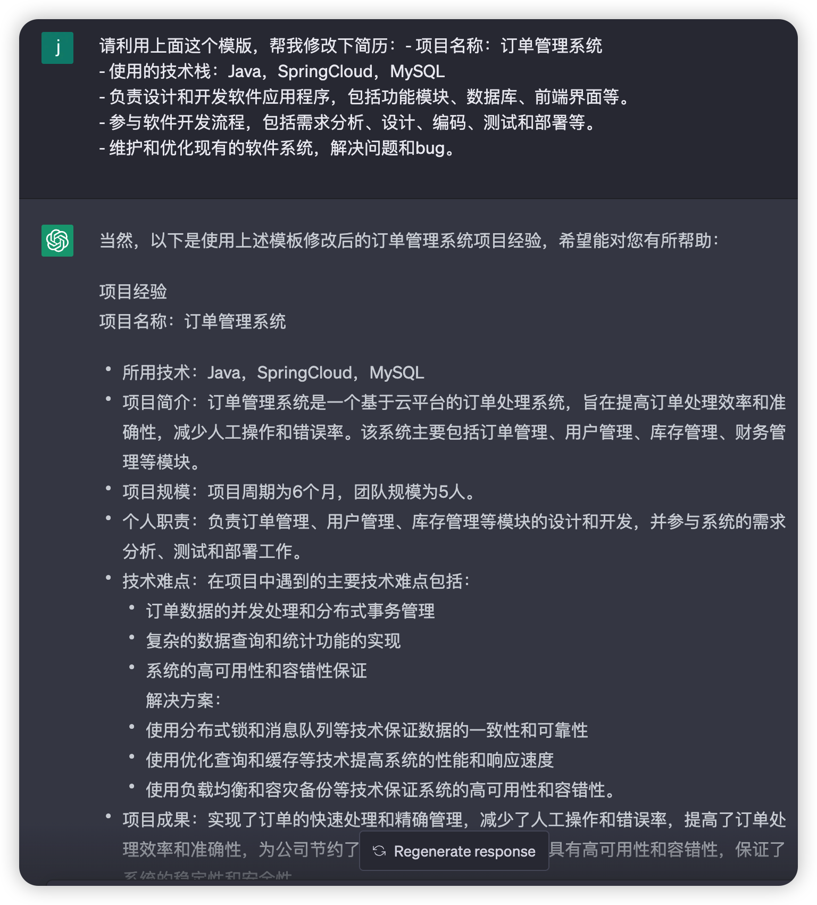
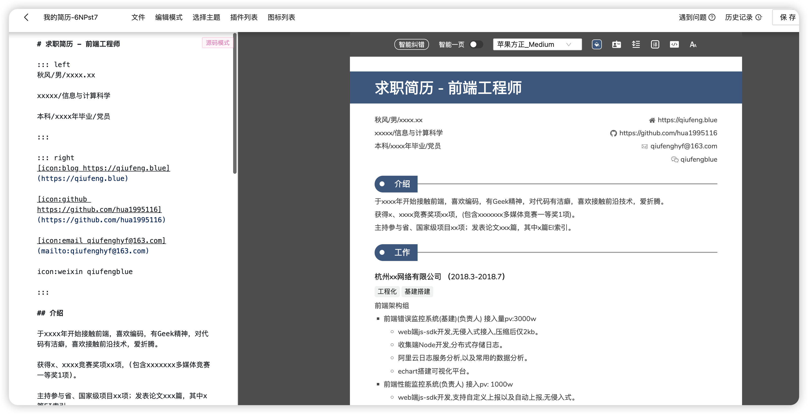

# 用 ChatGPT 修改简历

## 实验介绍

用 ChatGPT 这款 AI 工具帮助修改简历。

#### 知识点

- ChatGPT 修改简历
- 在线美化简历

## 背景

小张是一名 Java 工程师，现在正在找 Java 相关的工作，所以他开始在各大招聘网站投递自己的简历，但是收到面试邀请的寥寥无几，这让他郁闷了好久。

小张怀疑是不是自己的简历不过关，招聘者看过后感觉不合适就没有回音了。于是它在网上搜了下简历模板，发现和自己的项目并不是很契合，将简历调整了很多版，还是不满意。

这里面就涉及两个问题：

- 简历的内容是否足够吸引招聘者。
- 简历是否简洁美观。

现在有了 ChatGPT 这款 AI 工具，小张就可以借助它来帮助自己调整简历，另外再借助简历美化工具让简历看起来更简洁美观。

## 小张的简历

想让 ChatGPT 修改简历的前提就是我们得将简历发给 ChatGPT。

下面是小张的一份简历（个人信息被隐藏了）。

```sh
姓名：xx
联系方式：xx
学校：xx
学位：本科，专业：计算机科学
邮箱：xx

职业目标：
作为一名有经验的 Java 开发人员，我希望在一家创新型公司工作，负责设计和开发高质量的软件应用程序，为客户提供卓越的用户体验和业务价值。

技能：
- 熟练掌握 Java 技术。
- 熟练掌握 Spring、SpringBoot 框架等。
- 熟练掌握数据库设计和管理，包括 MySQL、Oracle 等。
- 熟练掌握缓存技术，包括 Redis。
- 熟悉软件开发流程和敏捷开发方法。
- 具有良好的沟通、团队合作和问题解决能力。

工作经历：
xx 公司 2020~2023 中级工程师

项目经验：
- 项目名称：订单管理系统
- 使用的技术栈：Java，SpringCloud，MySQL
- 负责设计和开发软件应用程序，包括功能模块、数据库、前端界面等。
- 参与软件开发流程，包括需求分析、设计、编码、测试和部署等。
- 维护和优化现有的软件系统，解决问题和bug。

证书和奖项：
- 三等奖学金
```

初看这份简历好像也没什么问题，但是细看就会发现很多问题：

- 简历内容千篇一律，没体现小张自身的优势。
- 技能部分没有体现技术的深度，看起来只是把技术栈的名字写在上面了。
- 项目部分没有介绍项目背景，没有讲解项目的亮点。

我们需要针对这份简历一点一点来修改。

## 修改简历的技能

我们可以将简历的技能部分发给 ChatGPT 来让它帮忙修改，关键语句如下：

> 帮我修改下简历的技能部分，让面试官眼前一亮，内容如下：xxxxx

这里面的最关键的是**让面试官眼前一亮**。



我们来看下 ChatGPT 的回答，它会对技能进行扩展，突出了技术深度和广度，同时使用了具体的例子和词汇，能够更好地吸引面试官的眼球，并给他们留下深刻的印象。

另外需要注意的是针对不同的职位和公司文化，需要进行相应的调整和优化。

## 修改项目经验

项目经验是简历中非常重要的部分，面试官会针对你的项目经验进行多维度的提问，如项目背景、用户量、访问量、技术选型、技术原理、遇到的问题等。所以我们一定要重点关注这部分的内容。

上面的项目经验的一个最大问题就是内容不规范，我们可以让 ChatGPT 提供一个比较好的模版。

### 项目经验模版

我们可以这样提问：

> 请提供一份让面试官眼前一亮的项目经验模版，谢谢。



这个模版里面描述了以下内容：

- 所用技术：列出所用的主要技术和工具
- 项目简介：简要描述项目的背景、目的和需求
- 项目规模：描述项目的规模、开发周期和人员规模等
- 个人职责：描述您在项目中扮演的角色和具体职责
- 技术难点：列出项目开发过程中遇到的主要技术难点和解决方案
- 项目成果：列出项目的主要成果和效果，如提高了业务效率、降低了成本、增加了收入等，尽量使用数据或指标来描述

然后我再用这个模版将之前写的项目经验调整下。

### 修改项目经验

应用上述模版来调整项目经验的术语如下：

> 请利用上面这个模版，帮我修改下简历：xxx



这个项目经验写得非常充实，突出了项目的背景、目标和作用，并列出了所用的主要技术和工具，重点突出了个人在项目中扮演的角色和具体职责。同时，突出了项目开发中遇到的主要技术难点和解决方案，并列出了项目的主要成果和效果，使用数据和指标来描述项目成果。

相信这份修改后的项目经验能让面试官眼前一亮。

## 美化简历

我们可以将自己的简历修改为 markdown 格式，然后复制到在线美化简历的网站，就能快速输出一份美化后的简历。

> https://www.mujicv.com/square/



## 实验总结

通过让 ChatGPT 对自己的简历进行分析，然后修改为让面试官眼前一亮的简历，最后再通过简历美化网站输出了一份简洁美观的简历，这样再将自己的简历投递出去，获取面试的机会就会增加很多哦。