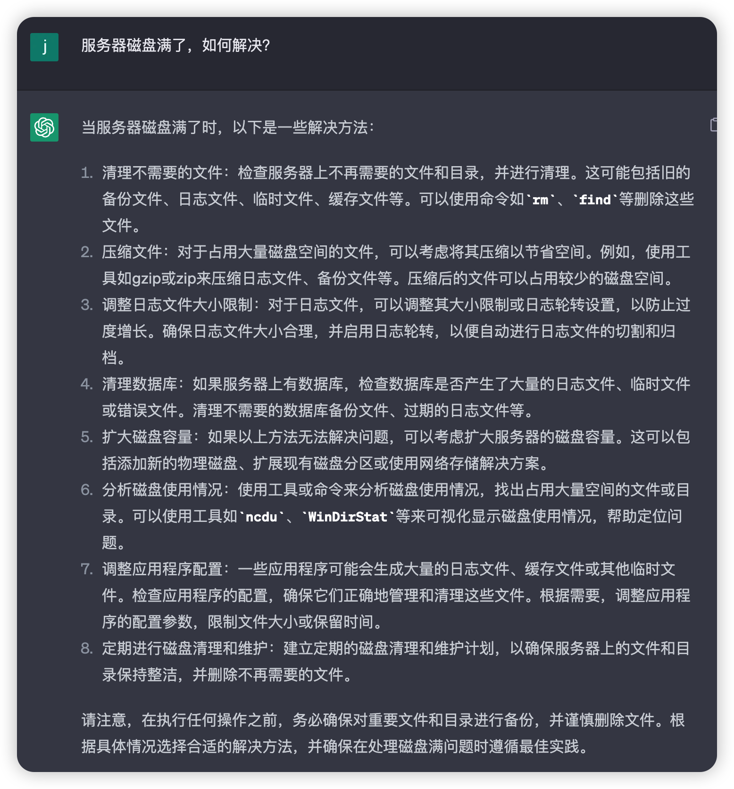

# 用 ChatGPT 帮助排查生产事故

## 实验介绍

用 ChatGPT 这款 AI 工具帮助运维工程师、研发工程师排查生产事故。

#### 知识点

- ChatGPT 排查生产事故

## 背景

小李是一家互联网公司的项目负责人，经常遇到线上生产环境的问题，为了排查和解决这些问题，往往会花费很多时间，而拖的时间越久，对公司的业务功能影响会越来越大，带来很大的经济损失。

现在有了 ChatGPT 这款 AI 工具，可以针对问题提供一些排查思路和解决方案，节省了大量时间成本、人力成本、降低了经济损失。

## 故障排查概述

### 生产环境故障排查涉及的角色

在生产环境故障排查过程中，通常涉及以下几个角色：

1. 运维工程师：作为运维团队的核心成员，运维工程师负责监控和维护生产环境。他们通常是首先接收到故障报告的人员，会通过监控工具、日志分析等方式来识别故障的源头，并进行初步的排查和处理。
2. 开发人员：开发人员在故障排查中扮演重要的角色。他们具有对应用程序代码的深入了解，并能够分析和解决与代码相关的问题。开发人员可以通过代码审查、调试和日志分析等方法来定位和修复软件缺陷和错误。
3. 网络工程师：如果故障与网络相关，例如网络延迟、连接问题或防火墙配置错误等，网络工程师将参与故障排查。他们负责检查网络设备、配置和路由，确保网络正常运行，并解决与网络相关的故障。
4. 数据库管理员（DBA）：如果故障与数据库相关，例如数据库性能问题、连接错误或查询错误等，数据库管理员将参与故障排查。他们负责监控和管理数据库系统，检查数据库配置、索引和查询执行计划，以解决与数据库相关的故障。
5. 安全团队：如果故障与安全问题相关，例如安全漏洞、入侵事件或恶意活动，安全团队将介入排查。他们负责调查和应对安全威胁，确保系统和数据的安全性，并采取相应的安全措施来修复和防止类似故障再次发生。

这些角色通常会在一个跨职能的团队中合作，共同分析和解决生产环境故障。他们将通过逐步排除和分析，定位故障的根本原因，并采取相应的纠正措施，以恢复系统的正常运行。

现在我们让 ChatGPT 充当上面的复合型角色，来帮助我们排查线上问题。

## 故障：服务器磁盘满了

线上系统突然报告很多异常，运维工程师第一时间发现了是磁盘满了的问题，然后通知了项目负责人小李。现在小李要开始排查故障了，如何让 ChatGPT 来帮忙呢？

### 验证磁盘是否已满

首先小李需要验证下磁盘是不是真的满了，可以这样向 ChatGPT 提问：

> 如何查看服务器磁盘的使用情况？

### 磁盘满了的排查思路

接着再来问下排查思路是怎么样的。

> 服务器磁盘满了，排查思路是怎么样的？

这上面的排查思路有很多，比如以下几个就是很常见的思路：

- 检查日志文件，往往出问题就出在日志文件太大，没有及时清理，导致越来越多的日志文件，把磁盘占满了。
- 检查数据库文件是否过大。当数据量越来越大，数据库占用的磁盘空间也会越来越大。

在排查磁盘满问题时，重要的是先定位占用大量空间的文件或目录，然后针对性地进行清理或调整。同时，也应该考虑实施一些日志和文件管理的最佳实践，以避免类似问题的再次发生。

### 如何解决磁盘满了

接下来就是如何解决磁盘满了的问题，可以这样进行提问：

> 服务器磁盘满了，如何解决？

核心思路就是定期清理不需要的文件，扩大磁盘容量。

## 故障：CPU 使用率 100%

小李又遇到运维人员的反馈，服务器上的 `CPU` 使用率 `100%` 了，接下来我们看下如何通过 ChatGPT 来帮助排查问题。向 ChatGPT 提问也是按照这三步走：

- 如何查看服务器 CPU 使用率？
- 服务器 CPU 使用率 100%了，排查思路是怎么样的？
- 服务器 CPU 使用率 100% 了，如何解决？

遇到其他问题，我们也是按照这三步走，相信也能成为排查生产事故的大牛。

## 实验总结

通过让 ChatGPT 帮助排查生产事故，以及提供解决思路，可以解决生产事故问题。

需要注意的是对生产环境的操作，一定要谨慎，且需要进行备份，确保操作失败后还能还原回来。