# 用 ChatGPT 提高算法和编程能力

## 实验介绍

用 ChatGPT 这款 AI 工具辅助提高算法和编程能力。让 ChatGPT 教我们如何高效的在 leetcode 上刷题，从而提升算法和编程能力。

#### 知识点

- ChatGPT 提供刷题指导
- ChatGPT 解答和讨论算法题
- ChatGPT 进行自我评估

## 背景

算法和编程能力在求职招聘中的要求越来越高，特别是大厂，在面试环节中都会出几道算法题，可能的原因如下：

1. 测量算法和编程能力：算法题可以有效地测量候选人的算法和编程能力。
2. 评估解决实际问题的能力：算法题往往模拟现实世界中的实际问题。面试官可以评估候选人在解决实际问题时的思维过程、设计能力和创新能力。
3. 候选人筛选和挑选：算法题可以帮助大厂筛选和挑选出具有优秀算法和编程能力的候选人。
4. 衡量学习能力和适应性：算法题要求候选人具备学习和适应的能力。面试官可以评估候选人的学习能力、适应能力和解决新问题的能力。

所以学好算法是非常重要的，常规学习算法的方式是到 leetcode 网站上刷题。但是这种方式对于新手来说也会遇到一些问题，所以可以借助 ChatGPT 来帮助我们更加有效的刷题。

### LeetCode 刷题带来的问题

1. 题目理解困难：LeetCode 上的题目往往以技术术语和算法术语描述，对于新手来说可能难以理解题目的意思和要求。这可能导致解题思路的困惑和错误的解答。
2. 缺乏基础知识：新手可能在算法和数据结构的基础知识方面相对薄弱，导致对题目的解题思路和算法选择不确定。在刷题之前，建议先学习基础的数据结构和常见的算法思想，以便更好地理解和解决问题。
3. 算法选择困难：LeetCode 上的题目通常有多种解题方法和算法选择。新手可能不确定应该选择哪种算法，或者不了解不同算法的适用场景和复杂度。这可能导致对算法选择的困惑和效率低下的解答。
4. 实现错误和调试困难：新手可能会遇到实现算法时的语法错误、逻辑错误和边界情况处理错误。调试这些错误可能会消耗较多的时间和精力。
5. 缺乏解题思路和技巧：解题思路和技巧是解决算法问题的关键。新手可能缺乏一些常见的解题思路和技巧，例如递归、动态规划、贪心算法等。这可能导致解题的困难和效率低下。
6. 时间限制和压力：LeetCode 上的题目通常有时间限制，新手可能需要花更多的时间来解决问题。同时，面对时间压力和竞争，可能会给新手带来一定的压力和焦虑。

## ChatGPT 如何帮助刷题

1. 题目解释和理解：ChatGPT 可以解释和澄清题目的意思和要求，帮助您更好地理解题目。您可以提供题目的描述和关键要求，然后询问 ChatGPT 以获得更清晰的解释。
2. 算法选择建议：如果您对于某个题目不确定应该选择哪种算法或解题思路，您可以描述问题的背景和限制条件，然后向 ChatGPT 询问关于算法选择的建议。ChatGPT 可以提供一些建议和常用的解题思路。
3. 解题思路和提示：当您陷入解题困境时，ChatGPT 可以为您提供解题思路和提示。您可以向 ChatGPT 描述您已经尝试过的方法和卡住的地方，然后寻求 ChatGPT 的建议和指导。
4. 代码调试和错误修复：如果您在实现算法时遇到错误或逻辑问题，您可以向 ChatGPT 提供相关的代码段并描述问题。ChatGPT 可以帮助您分析代码错误的可能原因，并提供一些建议和调试技巧。
5. 学习资源推荐：ChatGPT 可以向您推荐一些学习资源，如教程、博客文章、视频教程等，以帮助您深入理解算法和数据结构的概念，提升解题能力。

## ChatGPT 推荐学习资源

如果我们不知道看哪些学习算法的资料，可以让 ChatGPT 推荐一些资料。

> 请推荐一些比较好的学习算法的资源，比如书、视频、专栏、网站。最好是中文的。

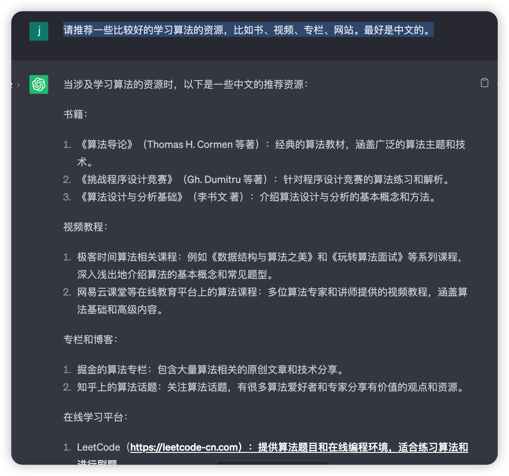

## ChatGPT 辅助刷题

### 从一道算法题开始

为了演示 ChatGPT 如何帮助我们练习算法题，首先我们得到 `leetcode` 上找一道算法题，我们就从最简单的算法题开始吧。

#### 两数之和

> 给定一个整数数组 `nums` 和一个整数目标值 `target`，请你在该数组中找出 **和为目标值** *`target`* 的那 **两个** 整数，并返回它们的数组下标。
>
> 你可以假设每种输入只会对应一个答案。但是，数组中同一个元素在答案里不能重复出现。
>
> 你可以按任意顺序返回答案。

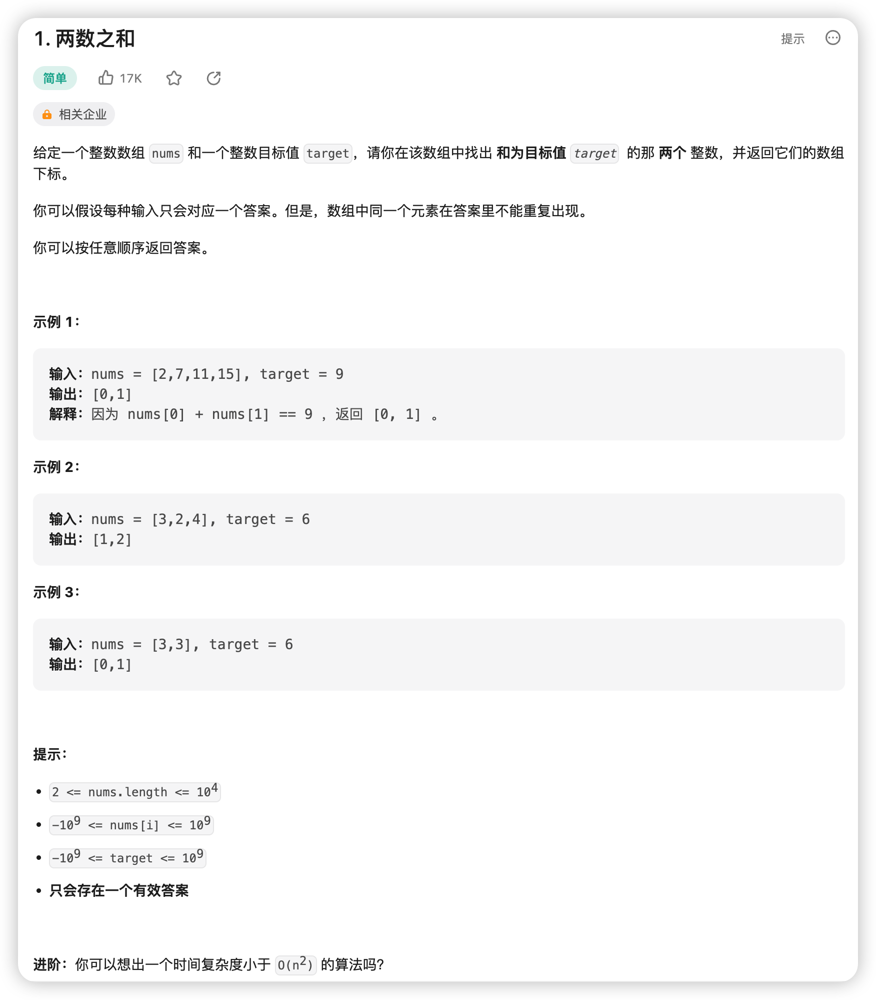

### 题目解释和理解

题干并不那么好理解，我们可以将题目输入到 ChatGPT 里面，让它帮忙解释下。

输入给 ChatGPT 的提示语格式如下：

> 解释下这个算法题，但不要给我提示：xxx

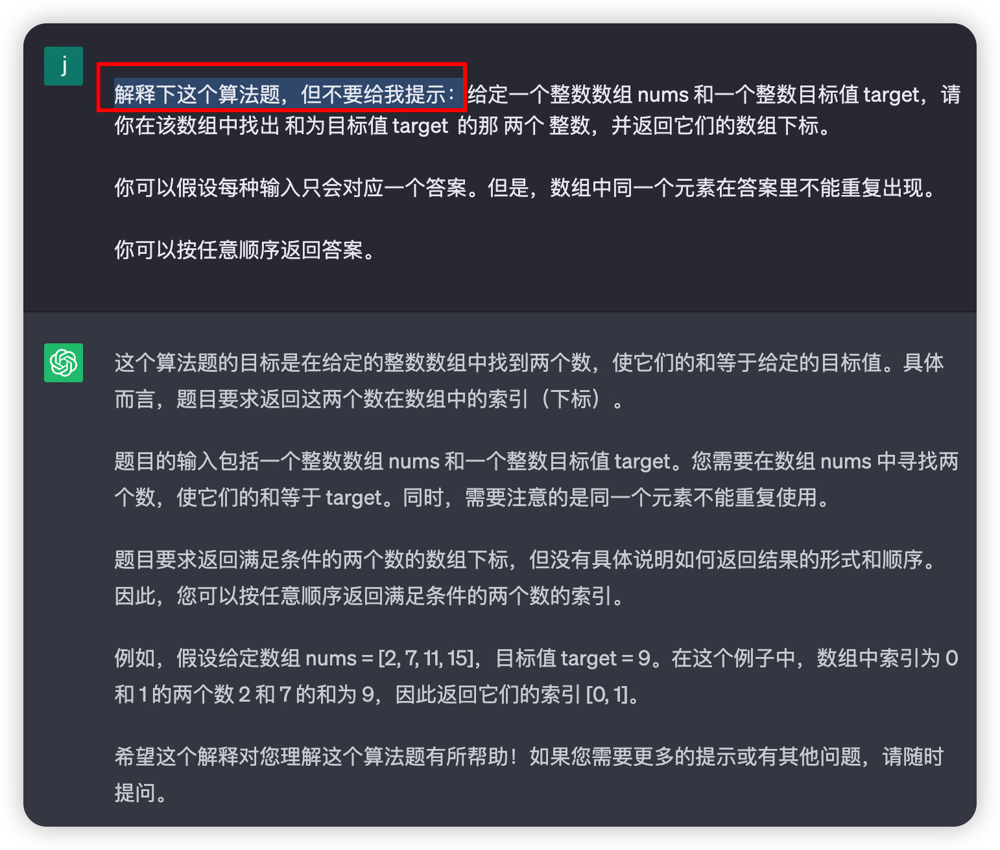

ChatGPT 解释了这道题是想做什么，如果你觉得它说得还是太深奥了，可以让它用大白话的方式再解释一遍。

> 解释下这个算法题，但不要给我提示，用大白话的方式：

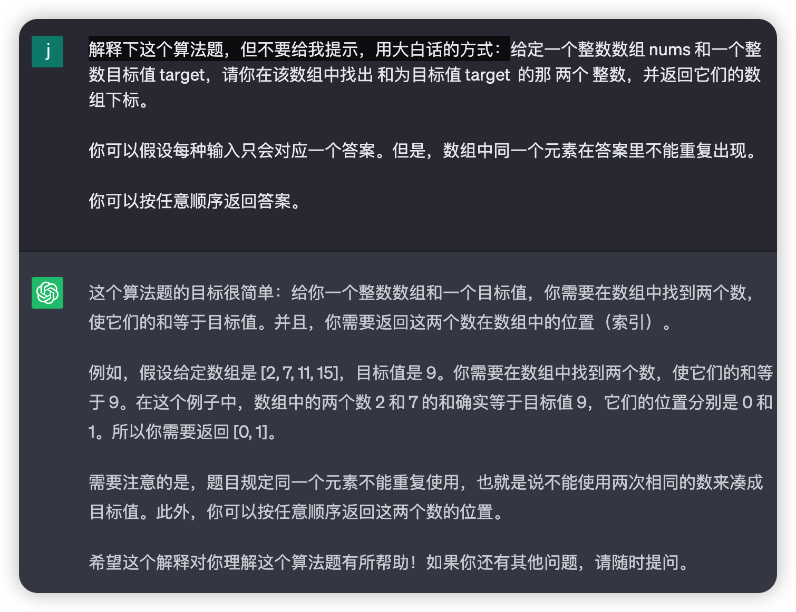

### 自己完成编程

理解了上面的解释后，我们就自行来实现这个需求。可以到 leetcode 的网站上编写，并验证结果。

这里我选择的编程语言是 Java，用了两个 for 循环，暴力解题的方式完成了编程。

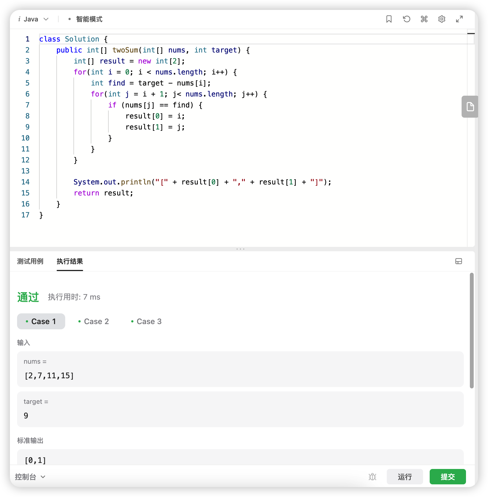

```JAVA
class Solution {
    public int[] twoSum(int[] nums, int target) {
        int[] result = new int[2];
        for(int i = 0; i < nums.length; i++) {
            int find = target - nums[i];
            for(int j = i + 1; j< nums.length; j++) {
                if (nums[j] == find) {
                    result[0] = i;
                    result[1] = j;
                }
            }
        }

        System.out.println("[" + result[0] + "," + result[1] + "]");
        return result;
    }
}
```

但这种方式的效率肯定不高，我们可以让 ChatGPT 帮忙分析一下我们的代码。

### ChatGPT 检验代码复杂度

> 根据上面的算法题，我的解答如下，帮我看下代码复杂度。`<这里填写你自己的代码>`

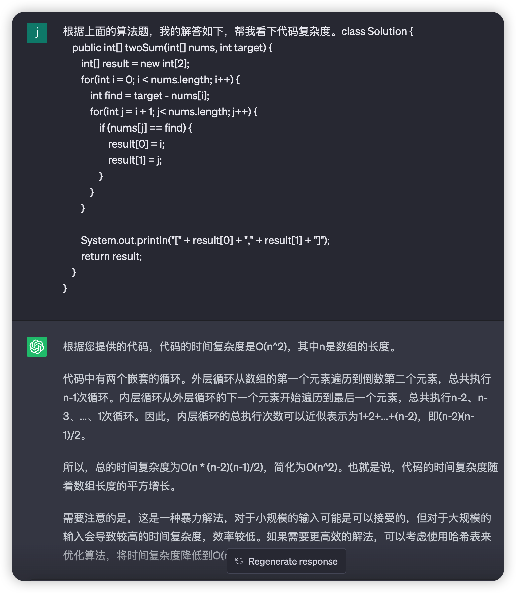

ChatGPT 回答了代码的时间复杂度是`O(n^2)`，其中 n 是数组的长度。

需要注意的是，这是一种暴力解法，对于小规模的输入可能是可以接受的，但对于大规模的输入会导致较高的时间复杂度，效率较低。

有没有比较高效的算法呢？我们接着来问下 ChatGPT。

### 算法选择建议

我们可以这样向 ChatGPT 提问，让它解答下有哪些合适的算法。

> 根据上面的算法题，有什么好的算法选择吗？

ChatGPT 推荐通过`哈希表`来解决。

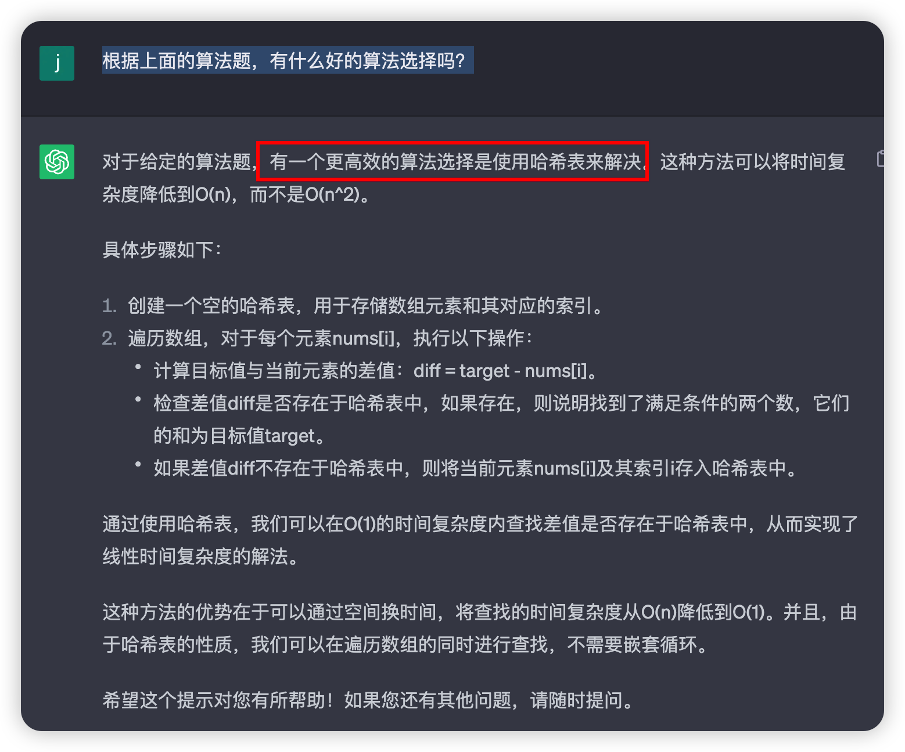

如果你不知道哈希表这种数据结构，我们还可以继续提问。

> 什么是哈希表？如何使用的？写个 Java 代码示例。

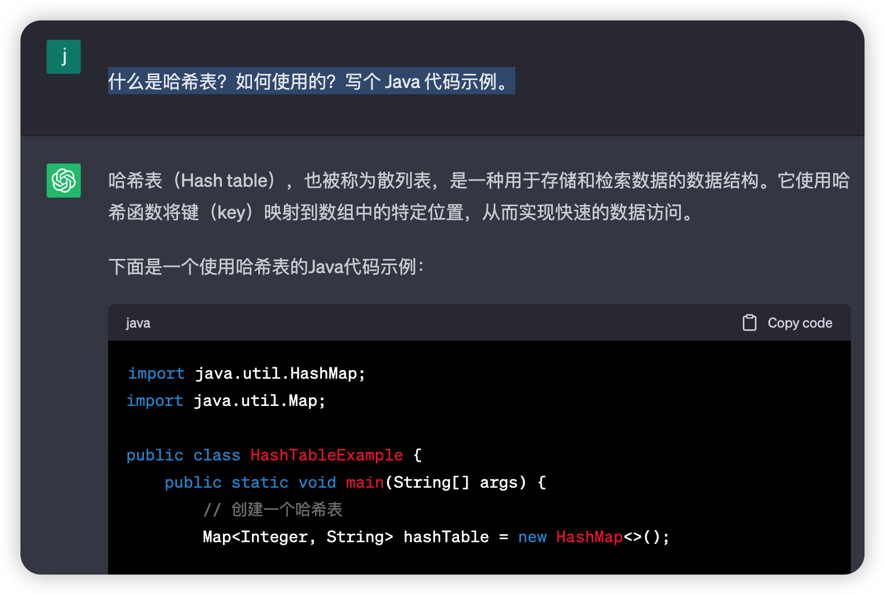

如果你还想看下还有哪些题解，可以这样向 ChatGPT 提问：

> 还有其他的题解吗？

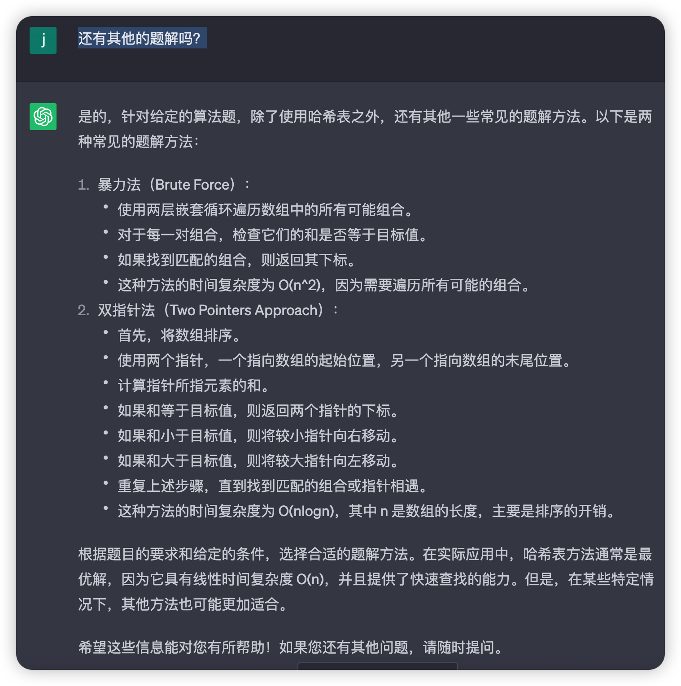

### 解题思路和提示

如果你尝试了使用哈希表来完成编码，试了很久都没有完成，那么我们可以让 ChatGPT 提供一些解题提示。

> 我尝试了用哈希表来解这道算法题，但是尝试了很久也没有解决，可以给我一些提示吗？

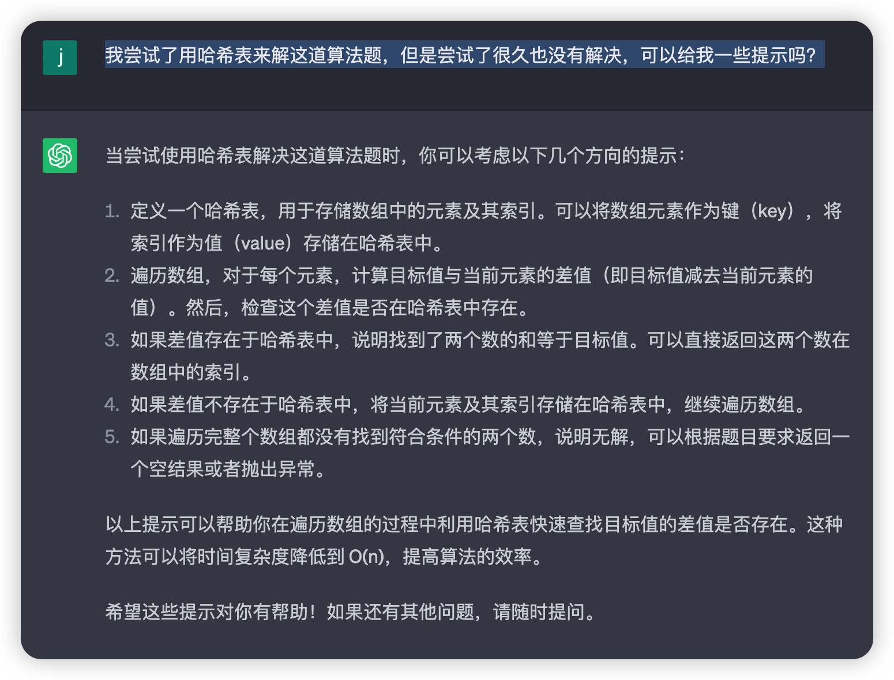

### 代码调试和错误修复

LeetCode 上编写代码时，会提示你哪个地方代码错误，但是如果你想调试代码，就得付费才行。不过我们可以借助一些编程工具来调试代码，比如强大的编程工具 IntelliJ IDEA。

如果你还不会使用这款工具，可以借助 ChatGPT 来指导你完成调试。

> IntelliJ IDEA 如何调试 Java 算法题？

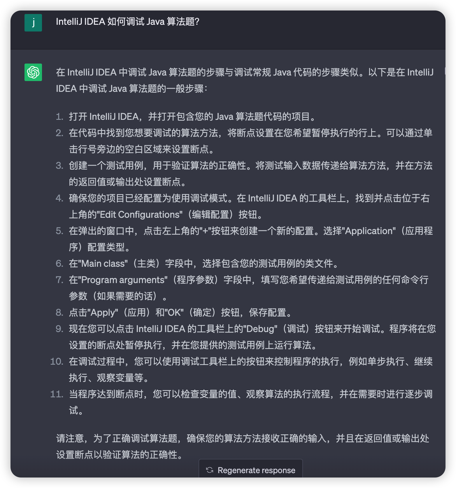

### 正确题解

我们还可以让 ChatGPT 输出一个正确的题解。不过你需要告诉它是基于哪种算法，这里我想知道的是基于哈希表的题解。

> 请提供一个基于哈希表的正确题解。

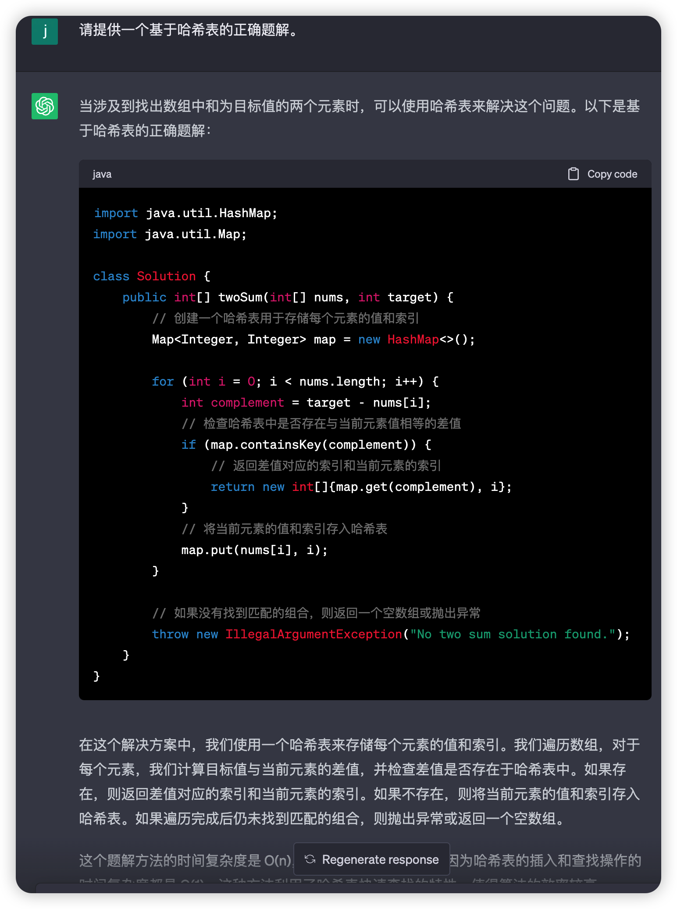

ChatGPT 不仅提供了正确的题解，还提供了解题思路，这样也方便我们学习。

## 实验总结

通过让 ChatGPT 帮助自己学习算法，提高刷题技巧和刷题效率，可以达到事半功倍的效果。主要涉及了 Leetcode 网站刷题的问题以及如何用 ChatGPT 来弥补 Leetcode 刷题的不足。从一道算法题开始，逐步深入讲解了如何用 ChatGPT 来辅助练习这道算法，后续算法题也可以按照上面的思路开始练习。